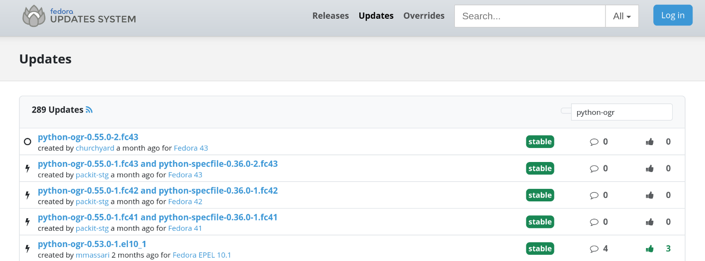

# `job: bodhi_update`



Create a new update in
[Fedora Bodhi](https://bodhi.fedoraproject.org) for successful
Koji build.
A Packit config file needs to be in the dist-git repository
to allow this job to be triggered.
Packit loads the config from the default dist-git branch (usually `rawhide`). Packit configs on other branches are ignored.


Packit provides an overview of its own updates [here](https://dashboard.packit.dev/jobs/bodhi-updates).

You can also utilise
[Fedora Notifications](https://apps.fedoraproject.org/notifications/about)
to tweak the notifications settings.

:::tip Downstream configuration template

You can use our [downstream configuration template](/docs/configuration/downstream_configuration_template) 
for creating your Packit configuration in dist-git repository.

:::

:::tip Automate the setup

You can also use [packit dist-git init](/docs/cli/dist-git/init.md) CLI command to create your
Packit dist-git configuration.

:::

## Supported triggers

* **commit** - Packit uses the original action as a config trigger, so you need to use `commit` as a trigger.
  The real trigger is a successful Koji build (that was triggered from a commit).
* **koji_build** - reacts to tagging of a Koji build into the configured sidetag group
  More info about releasing multiple packages together using sidetags can be found
  [here](/docs/fedora-releases-guide/releasing-multiple-packages.md).

## Required parameters

* **dist_git_branches** - the name of the dist-git branch(es) the build we want to use is coming from.
  You can also use the [aliases provided by Packit](/docs/configuration#aliases)
  to not need to change the config file when the new system version is released.

## Optional parameters

* **allowed_builders** - a list of accounts whose successful Koji builds will trigger Bodhi updates
  (defaults to `['packit']`). As each item of the list you can specify:
   - name of a FAS account, e.g. `my-fas`
   - name of a group - starting with `@`, e.g. `@my-sig`
     (don't forget to put the group name in quotes - a token in YAML is not allowed to start with `@`)
   - `all_admins` alias - allowing all users with admin access to the dist-git repo
   - `all_committers` alias - allowing all users with commit access to the dist-git repo
* **sidetag_group** - name of a sidetag group this Bodhi update should be created from.
  The name has to be unique across all projects that use Packit, so don't hesitate to be descriptive.
  A good convention is to use `${package1}-${package2}...${packageN}-updates`.
* **dependencies** - list of downstream package names that are required to be tagged
  into the configured sidetag group for this job to be triggered. For example, if you want to include
  a `koji_build` job with the same sidetag group configured in package `foo` in this update,
  you need to list `foo` here.

## Retriggering

For retriggering the job, see [retriggering docs](/docs/retriggering#bodhi_update).

## Example
```yaml
issue_repository: https://github.com/my-username/packit-notifications

jobs:
- job: bodhi_update
  trigger: commit
  dist_git_branches:
    - fedora-branched # rawhide updates are created automatically
    - epel-8
```
