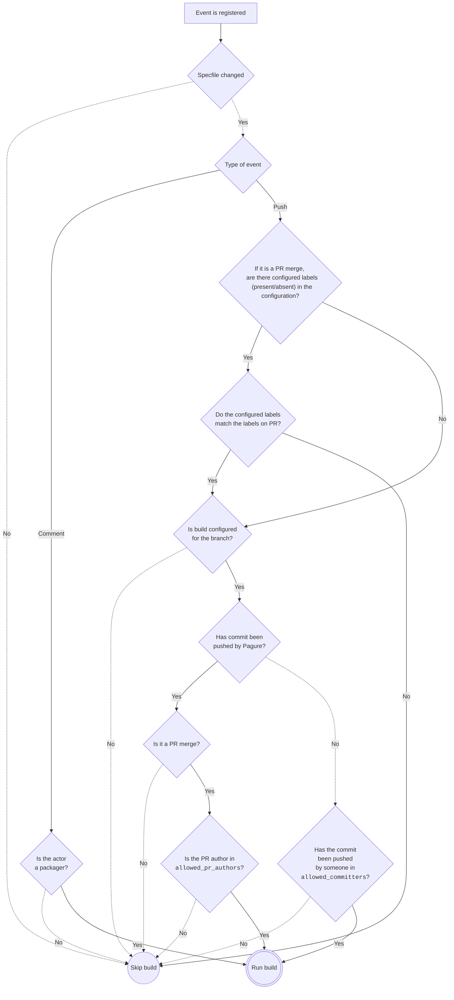

# `job: koji_build`

Trigger the build in
[Fedora Koji](https://koji.fedoraproject.org/koji/) build system
as a reaction to a new dist-git commit.
A Packit config file needs to be in the dist-git repository
to allow this job to be triggered.
Packit loads the config from the default dist-git branch (usually `rawhide`). Packit configs on other branches are ignored.

The build is triggered only for commits with a spec-file change.

By default, only merged pull requests created by Packit are being acted upon so the [proven packager
workflow](https://docs.fedoraproject.org/en-US/fesco/Provenpackager_policy/) is
preserved, [details
here](https://github.com/packit/packit-service/issues/1490). You can override this behaviour by specifying
`allowed_pr_authors` and/or `allowed_committers` in the job configuration (see below). For direct pushes, the committer needs to
be specified in the  `allowed_committers` and for merged pull requests the author of the PR needs to be
specified in the `allowed_pr_authors`.

There is no UI provided by Packit for the job,
but it is visible across Fedora systems (as you can see in the following image).
The koji build behaves as it was created manually, and you can utilise
[Fedora Notifications](https://apps.fedoraproject.org/notifications/about)
to be informed about the builds. Also, you can configure a repository where should we
open issues in case of errors during the job via [`issue_repository`](/docs/configuration#issue_repository) configuration key.

For retriggering the job, see [our release guide](/docs/fedora-releases-guide).

For Koji builds from upstream, see [`upstream_koji_build`](/docs/configuration/upstream/upstream_koji_build).

:::tip Downstream configuration template

You can use our [downstream configuration template](/docs/configuration/downstream_configuration_template) 
for creating your Packit configuration in dist-git repository.

:::

:::tip Automate the setup

You can also use [packit dist-git init](/docs/cli/dist-git/init.md) CLI command to create your
Packit dist-git configuration.

:::

## Supported triggers

* **commit** - reacts to new commits to the specified branch (in dist-git)

## Required parameters

* **dist_git_branches** - the name of the dist-git branch we want to build for when using **commit** trigger.
  You can also use the [aliases provided by Packit](/docs/configuration#aliases)
  to not need to change the config file when the new system version is released.

## Optional parameters

* **scratch** - defaults to `false`, use to create scratch (test) builds
  instead of the real production builds
* **allowed_pr_authors** - a list of PR authors whose merged pull requests will trigger Koji builds
  (defaults to `['packit']`). As each item of the list you can specify:
   - name of a FAS account, e.g. `my-fas`
   - name of a group - starting with `@`, e.g. `@my-sig`
   - `all_admins` alias - allowing all users with admin access to the dist-git repo
   - `all_committers` alias - allowing all users with commit access to the dist-git repo
* **allowed_committers** - a list of committers whose direct pushes to dist-git will trigger Koji builds
  (defaults to an empty list). It is enough to configure the `allowed_pr_authors` option if you want to have Koji builds 
  triggered only by merged pull requests.
  Similarly to the previous option, as each item of the list you can specify:
   - name of a FAS account, e.g. `my-fas`
   - name of a group - starting with `@`, e.g. `@my-sig`
   - `all_admins` alias - allowing all users with admin access to the dist-git repo
   - `all_committers` alias - allowing all users with commit access to the dist-git repo
* **require.label** - you can specify labels that have to be present/absent on a pull request
in order to trigger the build when it is merged. See configuration details [here](/docs/configuration#require).

:::info Processing of dist-git events from Pagure



Because of the potential issues with rendering:
- dotted lines represent _no_
- continous lines represent _yes_
:::

### Example

```yaml
issue_repository: https://github.com/my-username/packit-notifications

jobs:
- job: koji_build
  trigger: commit
  allowed_committers: ["jsmith"]
  dist_git_branches:
    - fedora-all
    - epel-8
```
