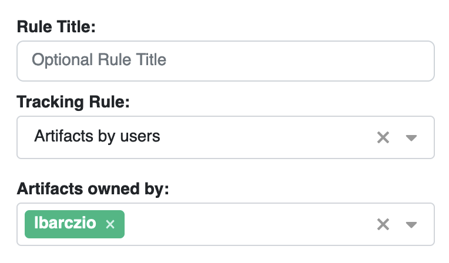

To stay informed about Packit-triggered activities in the Fedora ecosystem, 
you can use [Fedora Notifications](https://notifications.fedoraproject.org).

## Setting up
1. Go to https://notifications.fedoraproject.org/rules/new to create a new notification rule.
2. To be notified about package-related activities where you are an admin, configure the settings as shown 
below (replace the username with your Fedora username):

3. Click on `Add destination`:
- Choose your preferred notification method, such as email or Matrix handle (you might need to add them first in your account settings).
- Select services for which you want to be notified; for the Packit-related activities:
  - `distgit` - information related to `pull_from_upstream`/`propose_downstream` job 
  - `Koji` - information related to `koji_build` job 
  - `bodhi` - information related to `bodhi_update` job 
- Optionally, customise the topics from the Fedora messaging bus to focus on specific events. 
 You can see the list of topics [here](https://fedora-fedmsg.readthedocs.io/en/latest/topics.html).
   
Your setup might look something like this:

4. Save the rule by clicking on `Create rule`.

Once set up, you will receive emails like this:

You can adjust this rule anytime to match your preferences.