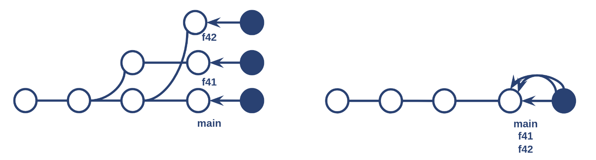

# Non-divergent dist-git branches



To prevent your dist-git branches from diverging, you can use the following `dist_git_branches` syntax:

```yaml
  dist_git_branches:
    rawhide:
      fast_forward_merge_into: [fedora-branched]
    epel-9: {}    
```

In this example, Packit runs the downstream synchronization process for the `rawhide` and `epel-9` branches as usual. Additionally, Packit opens a new pull request reusing the commit from `rawhide` for every `fedora-branched` branch, allowing it to be fast-forwarded when merging.

You can learn more about the `dist_git_branches` syntax for `propose_downstream` [here](docs/configuration/upstream/propose_downstream#optional-parameters) and for `pull_of_upstream` [here](docs/configuration/downstream/pull_from_upstream#optional-parameters).

:::warning How to Reconcile Divergent Branches

If you are already using Packit, your branches may have diverged. You need to reconcile them before using the new `dist_git_branches` syntax. For the configuration example above and the current state of the branched Fedora releases, you need to:

```
git checkout rawhide
git merge f39
git merge f40
git merge f41
```

You shouldn't encounter any conflicts. However, if you have a conflict in the `.gitignore` file, it is safe to keep changes from both `rawhide` and the incoming branch. If you have a conflict in the changelog section of the specfile, ensure you **merge all the missing changelogs** into `rawhide` and list them **in the correct order** (newest changelogs first). Once `rawhide` is ready, you can proceed with:

```
# [TODO] Adjust the releases, if needed.
git checkout f39; git merge --ff-only rawhide
git checkout f40; git merge --ff-only rawhide
git checkout f41; git merge --ff-only rawhide
```

:::

:::warning Fast Forwarding multiple commits does not automatically trigger a Koji build (Yet)

Unfortunately, there is a [bug](https://github.com/packit/packit-service/issues/2537) that prevents Packit from triggering the **Koji build** when more than one commit has been forwarded in a branch.

You can work around this bug by manually retriggering the Koji build by commenting on the downstream merged pull request with `/packit koji-build`.

:::
