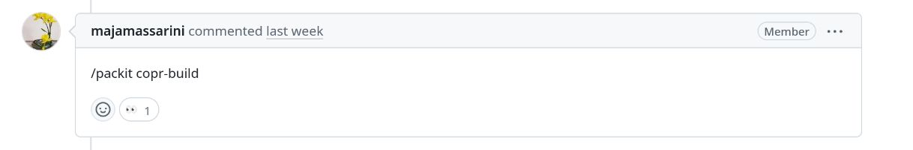

## Comments
In general, you can put a `/packit <job-you-want-to-trigger>` comment
to trigger the Packit job manually.

### help
Packit is able to provide a help message summarizing all available commands and options:

    /packit help

### copr_build
For retriggering the [`copr_build`](/docs/configuration/upstream/copr_build) jobs, Packit is able to trigger new builds based on a pull request comment:

    /packit copr-build

or the shorter version

    /packit build

So whenever you run into a flake or feel like you want to retrigger, just type
that comment into the PR and enjoy some fine, fresh builds.

The same can be used to retrigger jobs configured with either `commit` or `release` 
trigger by specifying the respective arguments, using commit comments:

    /packit build --commit <branch-name>

or

    /packit build --release <tag-name>

If no additional arguments are provided, Packit defaults to the commit trigger on the repository's 
default branch. The job will execute only if a corresponding job configuration exists for the 
specified branch or release and if the commit is included on the specified branch or tag.

It is also possible to re-trigger only the failed builds using a pull request comment

    /packit rebuild-failed

### propose_downstream
For retriggering the [`propose_downstream`](/docs/configuration/upstream/propose_downstream) jobs, users with write or admin permissions to
the repository can retrigger an
update via a comment in any open issue in the upstream repository:

    /packit propose-downstream

### tests

For retriggering the [`tests`](/docs/configuration/upstream/tests) jobs, you can use a pull-request comment:

    /packit test

The same can be used to retrigger jobs configured with either `commit` or `release` 
trigger by specifying the respective arguments, using commit comments:

    /packit test --commit <branch-name>

or

    /packit test --release <tag-name>

If no additional arguments are provided, Packit defaults to the commit trigger on the repository's 
default branch. The job will execute only if a corresponding job configuration exists for the 
specified branch or release and if the commit is included on the specified branch or tag.

And to re-trigger only the failed tests in pull request, you can use

    /packit retest-failed

#### Running tests with builds from another pull request
It is also possible to run the tests with Copr builds built by Packit in another pull request 
(in a different repository). This can be useful when you are working on a change that spans 
multiple projects and needs to be tested together.
These tests are possible to trigger only via a comment containing the argument specifying the pull request as:

    /packit test <namespace>/<repo>#<pr_id>

The requirement is that in the specified PR, there were recent successful builds created by Packit
for the targets configured in the repository with the "main" pull request.
This is a new feature, so the behaviour may be adjusted in the future. 
Please reach out back to us for help or with your suggestions.

#### Running tests with a specific identifier
It is possible to run a specific job via `/packit test` command. 
The user just needs to specify the argument `--identifier <job_identifier>` and Packit will trigger only the job with this identifier.
The whole command should look like this: `/packit test --identifier my-job-id`.
You can also configure [`test_command.default_identifier`](/docs/configuration#default_identifier) to allow commonly used jobs
to be triggered without the need for manual specification.

#### Running a group of tests with the same label
Users can trigger a specific group of jobs that has a specific value in the list of `labels` option.
The command to pick up these jobs is `/packit test --labels regression,upgrade` where either `regression` or `upgrade` must be present in `labels` option for the job.
The labels should be in the format of comma-separated string.
You can also configure [`test_command.default_labels`](/docs/configuration#default_labels) to allow commonly used job combinations
to be triggered without the need for manual specification.

#### Running tests with specific environment variables
From time to time, you may need to pass specific environment variables to your jobs. 
To achieve this, you can use the `--env` option in the comment command `/packit test`, which passes environment variables to Testing Farm.
You can set as many environment variables as you want; you just need to pass `--env `for each one. 
For example, you can use the following command `/packit test --env MY_ENV=test --env MY_ENV_2=test_2`.
This command allows you to use `MY_ENV` and `MY_ENV_2` in Testing Farm jobs.
You can also unset an environment variable by not setting its value like `/packit test --env MY_ENV=`.

### upstream_koji_build

For retriggering the [`upstream_koji_build`](/docs/configuration/upstream/upstream_koji_build) jobs, you can 
again use a pull-request comment:

    /packit upstream-koji-build

### vm_image_build

[VM Image builds](/docs/configuration/upstream/vm_image_build) are not triggered automatically at all.
To trigger them, users with write access to the repository need to post a pull-request comment:

    /packit vm-image-build

every time.

### pull_from_upstream
For retriggering the [`pull_from_upstream`](/docs/configuration/downstream/pull_from_upstream) jobs, packagers can retrigger the job
via a comment in any dist-git pull request:

    /packit pull-from-upstream

This will take the Packit configuration file from the default branch of the dist-git
  repository (`rawhide`), same as if the job was triggered by a new release. 
You can monitor the job in [Packit Dashboard](https://dashboard.packit.dev/jobs/pull-from-upstreams).
To use the configuration file from the dist-git pull request you are commenting on, you can add an argument:

    /packit pull-from-upstream --with-pr-config

`pull-from-upstream` automatically handles the Bugzilla created by Upstream
Release Monitoring (by default adds `Resolves` to changelog/commit and exposes `PACKIT_RESOLVED_BUGS` to the `changelog-entry` and `commit-message`
actions). If you want to override the referenced resolved bug set by Packit, you can retrigger `pull_from_upstream` like this:

    /packit pull-from-upstream --resolve-bug rhbz#123,rhbz#124

### koji_build

For retriggering the [`koji_build`](/docs/configuration/downstream/koji_build) jobs, packagers can retrigger a build by a comment in a dist-git pull request:

    /packit koji-build

The build will be triggered for the target branch of the pull request using the most recent commit on the target branch
(NOT the HEAD commit of the pull request). 

If Packit created an issue in the configured `issue_repository`, you can place the same comment in that
issue to retrigger the builds (see [`issue_repository`](/docs/configuration#issue_repository) for details).

### bodhi_update
For retriggering the [`bodhi_update`](/docs/configuration/downstream/bodhi_update) jobs, packagers with write access to the dist-git repository can retrigger an update by a comment in a dist-git pull request:

    /packit create-update

The update will be triggered for the target branch of the pull request. 

If Packit created an issue in the configured `issue_repository`, you can place the same comment in that
issue to retrigger the updates (see [`issue_repository`](/docs/configuration#issue_repository) for details).

##  GitHub Checks UI
In GitHub Checks interface, it is also possible to re-trigger a specific task just by clicking on `Re-run`
for the particular check:

The button is available only for users with write permissions to the repository.
