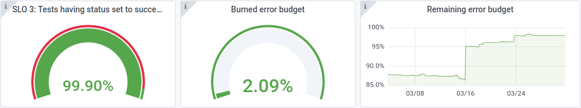

# Service Level Objectives

Packit is using the concept of [Service level
objectives](https://sre.google/sre-book/service-level-objectives/) defined in
Google's SRE book. It means that when we run out of error budget, we stop all
the work on new features and start stabilizing the service to get our budget back.

We have 3 objectives defined for Packit right now.

:::caution

Screenshots below are not being updated in real time. They are just a snapshot
of the state in time when this document was written so that you can see some
actual numbers.

:::

## SLO1: Changes to GitHub PRs receive the first status update within 15 seconds in 99% of cases

We want you to know as soon as possible that Packit is working on your request.

## SLO2: 98% of builds have status set to success or failure within 5 minutes after the Copr build has finished

Once Packit works on a build, you should see that the work is done within a
reasonable time.

## SLO3: 95% of test runs have status set to success or failure within 12 hours

The same as SLO2 except this is for tests. Testing Farm is a more complex
system so we reduced the number here.

If you are interested, here's the accompanying research:
[github.com/packit/research/../error-budgets](https://github.com/packit/research/tree/main/error-budgets)

Unfortunately, we cannot share our Grafana instance with you since it's hidden
behind a firewall.
