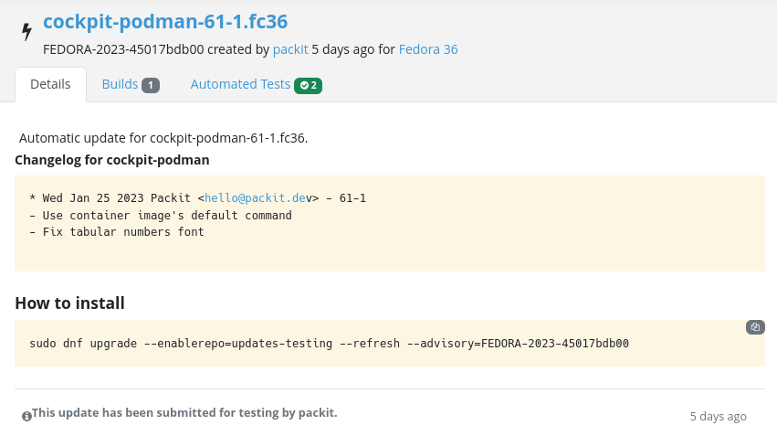
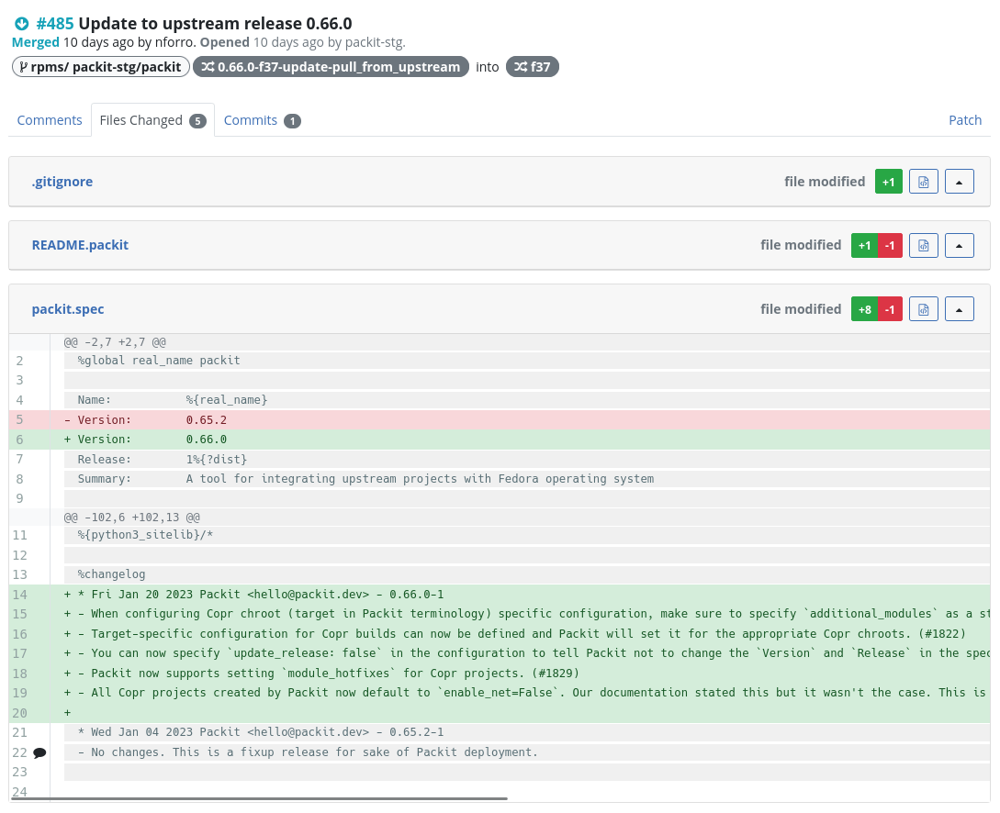
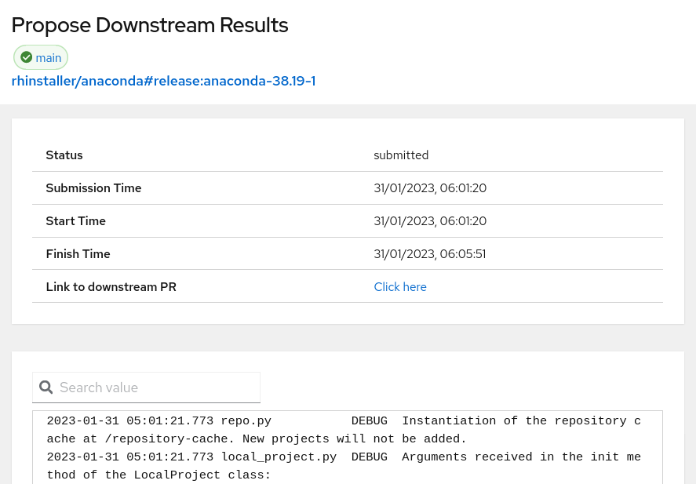
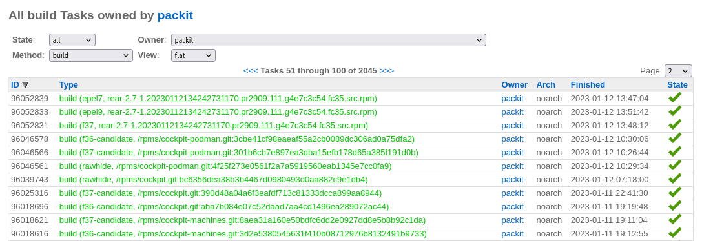
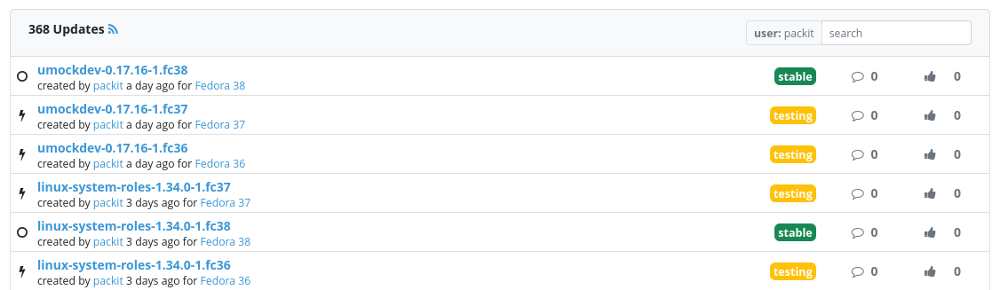
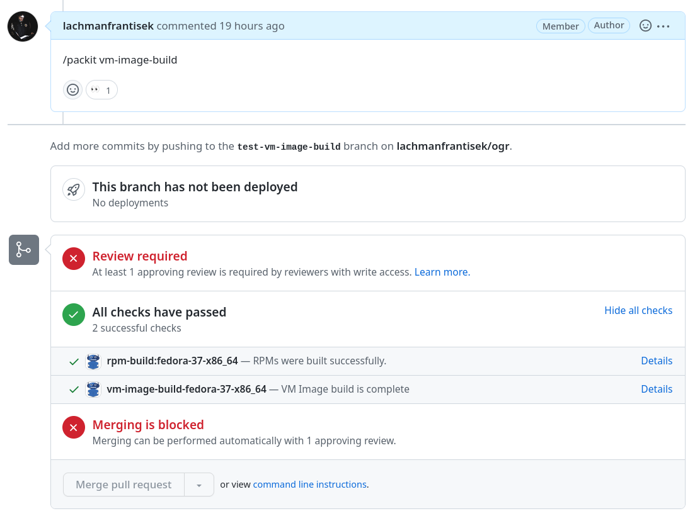

## Packit project in 2022

As you will see in the following paragraphs, the year 2022 was really fruitful for the Packit project. Without further ado, let’s take a look at what the Packit team accomplished last year!

<!--truncate-->

## Fedora automation

We have made a huge improvement in downstream automation. At the beginning of the year, we [finished the workflow](https://packit.dev/posts/downstream-automation/) and you are now able to use Packit to get your release from upstream via dist-git and Koji to Bodhi. As usual, you can pick just what you need. This workflow consists of three jobs:

- `propose-downstream`: as a reaction to an upstream release, the source archive is saved to a lookaside cache, specfile is updated and sent as a pull request to Fedora dist-git.
- `koji-build`: as a reaction to a new dist-git commit, a new Koji build is triggered (you can specify allowed authors of a commit or merged pull request).
- `bodhi-update`: as a reaction to a successfully finished Koji build, a new Bodhi update is created

But that wasn’t all. At the very end of the year, the Packit team implemented an alternative to the `propose-downstream` job that we call `pull-from-upstream`. The logic of the job is the very same: the source archive is saved to a lookaside cache, specfile is updated and sent as a pull request to Fedora dist-git. The only – and main – difference is that the job is defined downstream (in the default dist-git branch, `rawhide` or its `main` alias) so you don’t need to install Packit in the upstream repository. The information about a new release is received from the [Upstream Release Monitoring](https://docs.fedoraproject.org/en-US/package-maintainers/Upstream_Release_Monitoring). The `pull-from-upstream` job is mainly targeted to the Fedora maintainers without upstream access or with upstream not being supported by Packit. (This job works with any upstream using git.) The setup is nicely described in [this blog post](https://packit.dev/posts/pull-from-upstream). And if you want a dedicated documentation page for the Fedora downstream automation, look at https://packit.dev/docs/fedora-releases-guide/.

And that’s still not all, we’ve also added `propose-downstream` to [our dashboard](https://dashboard.packit.dev). You can now the jobs in [the Pipelines view](https://dashboard.packit.dev/pipelines). Also, logs can be checked on a detail page (that can be accessed from a status of a release commit).

Still not convinced we’ve done a lot? When using various downstream jobs, you can still hit an issue now and then. (Messages from Fedora infrastructure can get lost or some intermittent error can occur.) Packit automatically retries to overcome temporary issues, but sometimes it’s not enough or there is a real problem that needs to be fixed elsewhere. We can’t resolve the real problems for you, but we can help let you retry the job when needed. And you have two places where to do that.

As you might be used to with the `propose-downstream` job, you can use comments in an upstream issue to retrigger Bodhi updates and Koji builds as well. Just configure [`issue_repository`](https://packit.dev/docs/configuration/#issue_repository) so Packit knows where to create issues in case of problems. (This does not need to be an upstream issue and this repository can be used for multiple projects.) Alternatively, if you use dist-git pull requests (either made by Packit or other maintainers), you can use a pull request comment to retrigger Koji Build or Bodhi update.

If you are interested in what Packit has done for its users, you can take a look at the activity of the `packit` (or `packit-stg`) FAS user in [dist-git](https://src.fedoraproject.org/user/packit), [Koji](https://koji.fedoraproject.org/koji/userinfo?userID=4641) or [Bodhi](https://bodhi.fedoraproject.org/users/packit).

## SRPM in Copr

Throughout the 2022 we have implemented support for building SRPMs in the Copr and slowly started introducing newly-onboarded projects to use Copr right from the start. The definitive switch to Copr has been done at the beginning of 2023. For more details, take a look at the [relevant blog post](https://packit.dev/posts/copr-srpms/), but let’s shortly describe the benefits:
Most importantly, you can now use [`srpm_build_deps`](https://packit.dev/docs/configuration/#srpm_build_deps) config option to specify the dependencies needed for the build. With the [old solution](https://github.com/packit/sandcastle), this process was manual, global and had to be done by Packit maintainers. Another advantage of being able to use Copr for SRPM builds is access to the SRPM artifacts.

## Self-mapping of FAS account

From the beginning of the Packit project, for every Packit GitHub installation, we have required a Fedora account so we can be sure, that we are safe to use Fedora systems (like Copr or dist-git) on behalf of that user. Since we automate various tasks for you, we’ve made it possible for you to perform this yourself. (Thanks to the user config field in the Fedora Account System.)
If you are interested in how this works, take a look at the blog post we’ve prepared for you: https://packit.dev/posts/fas-verification-automation/

If you wonder why we check permissions for the installation, we have good news for you. This year, we plan to improve the permission schema, do the checks for each job, and require only what is needed. But more about the plans for 2023 later.

## Multiple-project test runs

If you have multiple connected projects (as we do) and work on a feature spanning more of them, the following feature might come in handy. You can use a commit command with a reference to the other pull request and Packit will use Copr builds from both pull requests during the tests. Want to know more? Check this blog post: https://packit.dev/posts/testing-farm-triggering/

## Specfile library

This one might not be relevant to most of our users, but we would still like to announce, that we’ve created [a Python library](https://github.com/packit/specfile) for specfile manipulation. It can not only parse various weird spec files but also can edit them with as little diff as possible. Also, the code is really interesting so check it out. Now, it’s used by Packit and [rebase-helper](https://github.com/rebase-helper/rebase-helper) and you can watch [this demo](https://www.youtube.com/watch?v=yzMfBPdFXZY&t=17s) if you want to know more.
In case you’ve missed that, this is not the first time we’ve extracted a part of our codebase for wider usage – another nice example is a [forge-independent Python library for GitHub/GitLab/Pagure API called OGR](https://github.com/packit/ogr/).

## VM Image Builds

Having Copr builds available for your pull-requests is really nice, but you can now have VM image builds as well. It would be really wasteful to do this for each and every commit so we decided to trigger this by a `/packit vm-image-build ` comment. Similarly to other jobs, Packit uses an external system to do the hard work. This feature is possible thanks to the [Red Hat Image Builder](https://console.redhat.com/insights/image-builder). This feature is a fresh start on this journey and we are investigating the possibilities of Packit in this field. Check [our documentation](https://packit.dev/docs/configuration/upstream/vm_image_build) and let us know what you think.

## Plans for the next year

Do you wonder what we plan for you for the year 2023? That is not a secret. For some time, we have been opening our planning and since the last year, you can check our [Kanban board](https://github.com/orgs/packit/projects/7/) since it has become the primary place we use on daily bases. (It used to be half-manually and half-automatically synced.)
Every quarter, our team sits down and discusses our plans for the next three months. We use MOSCOW (=MUST x SHOULD x COULD x WON’T) prioritisation method to group and compare all of our epics. The result of this time’s planning can be seen [here](https://github.com/orgs/packit/projects/7/views/25).

Do you want to know how we decide and how you can influence us? It’s pretty easy. Firstly, we need to know about a bug or feature request. Secondly, the task needs to be worth the work. (And should be related to our mission.) We can’t work on everything so we need to pick the work with a bigger impact (a lot of projects will benefit from that or a significant benefit for a smaller group). So shortly, if you want something to be done: create an issue, provide a clear reasoning why we should do that and find other projects that can benefit from that.

And also, our project is open source. We are more than happy to help anyone contribute to our code base!

---

With that, I, personally, would like to thank all of the Packit team members for their outstanding work during the year. And I also would like to thank you, our users, for using our project, being kind, helpful and patient! I wish you all a happy new year and less mundane work as possible!

On behalf of the Packit team,
František
