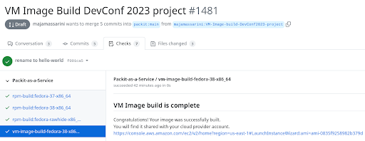
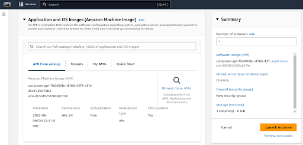
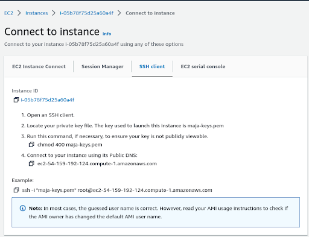

Have you ever wanted to bring your pull request changes in a cloud image easily?
Curious about how easy it can be? With Packit, it can be just about commenting on your pull request with `/packit vm-image-build`.

With the above command, Packit automates all the manual steps needed to create an
RPM package with your pull request changes and asks the Image Builder to install it
inside a brand new cloud image.
Let's have a look at the prerequisites for this.

<!--truncate-->

# Join the Red Hat Developer Program

If you don't already have a business account you can create a
_Red Hat Developer account_ at no cost [here](https://developers.redhat.com/about).

You need a subscription in order to use the
[Image Builder service](https://console.redhat.com/insights/image-builder)
and launch the builded images in the [AWS management console](https://aws.amazon.com/console/).

# Prepare to upload AWS AMI images

Before uploading an AWS AMI image, you must configure the AWS system for receiving them.

### Prerequisites

- You must have an Access Key ID configured in the [AWS IAM account manager](https://aws.amazon.com/iam/).
- You must have a writable [S3 bucket](https://docs.aws.amazon.com/AmazonS3/latest/gsg/CreatingABucket.html) prepared.

### Procedure

Follow [these steps](https://access.redhat.com/documentation/en-us/red_hat_enterprise_linux/8/html/composing_a_customized_rhel_system_image/creating-cloud-images-with-composer_composing-a-customized-rhel-system-image#preparing-for-uploading-aws-ami-images_creating-cloud-images-with-composer)
to satisfy the above prerequisites.

# The manual steps

Are you wondering what are the manual steps for bringing your pull request changes
in a cloud image and why you should automate them?

There could be many ways to achieve this goal but let's see together the closest to our
automated solution. Below you can find a summary of all the needed manual steps;
I am quite sure after reading them, you will want to automate them with Packit!

- Build an RPM package with your pull request changes through **COPR**, go to https://copr.fedorainfracloud.org
  1. Install `copr-cli`.
  2. Create your account and service token.
  3. Add your token to `~/.config/copr.
  4. Create a new COPR project.
  5. Start a build with your local pull request changes using `copr-cli`.
  6. **WAIT for the build to finish**.

- Create a new cloud image through the **Image Builder console**, go to https://console.redhat.com/insights/image-builder
  7. Login with your _Red Hat developer_ account.
  8. Click on the `Create Image` button, choose _AWS image_ type and follow the wizard.
  9. **WAIT for the build to finish**.
  10. Open the `Launch` link for the builded image.

- Launch and access the AWS image through the **AWS management console**, go to https://aws.amazon.com/console/
  11. The previous link will open an AWS console tab with the
      _Launch an Instance_ wizard preset to use the builded image.
      You need to login into the _AWS management console_ using an _AWS Account ID_
      allowed to access the _AMI Image_ you just created.
  12. Select a **Key pair**, or create one if you don't have it already,
      to be able to ssh the image later.
  13. Click on `Launch Instance`
  14. Connect to instance using an ssh client
  15. Add the previously created COPR repo to the list of available dnf repositories.
  16. Install the package you have created at step number 4.
  17. Now you are ready to test your code in a real cloud image.

For every new pull request you want to test directly in a cloud image you have to repeat
steps 4-16 or automate them through Packit!

# Automate the steps

## Install Packit

Installing Packit is pretty straightforward.

1.  Create a valid [Fedora Account System (FAS)](https://fedoraproject.org/wiki/Account_System)
    account (if you don't already have one).
    Why do you need it? After these few steps you will start building (and potentially shipping)
    Fedora packages through the [COPR service](https://copr.fedorainfracloud.org/) and we need you to agree with the Fedora license.
2.  Install our GitHub application on [GitHub Marketplace](https://github.com/marketplace/packit-as-a-service),
    or [configure a webhook](https://packit.dev/docs/guide/#how-to-set-up-packit-on-gitlab) on GitLab
    (depending on where your project lives).
3.  Make Packit [approve your FAS username](https://packit.dev/docs/guide/#2-approval);
    on Github the approval process is automated and for Gitlab you have to contact us.

Now you are ready to automate the process as described below.

## Setup Packit

Create a `.packit.yaml` configuration file in your pull request.

But just the first time! After your pull request has been merged, Packit will take the `.packit.yaml` file from the target _main branch_.

The configuration file will look like the following:

```
---

jobs:
- job: copr_build
  trigger: pull_request
  targets:
  - fedora-all

- job: vm_image_build
  trigger: pull_request
  image_request:
    architecture: x86_64
    image_type: aws
    upload_request:
      type: aws
      options:
        share_with_accounts:
        - < shared-aws-account-id >
  image_distribution: fedora-39
  copr_chroot: fedora-39-x86_64
  image_customizations:
    packages: [hello-world]
```

### copr_build job

The first job tells Packit service to build an RPM package, for the Fedora release you want,
in this example all the active fedora releases, and to add your pull request changes to the package.

To further customize the COPR builds made by Packit you may want to give a look at this
[guide](https://packit.dev/docs/configuration/upstream/copr_build).

### vm_image_build job

The second job tells Packit how to configure the Builder Image service.

The first two lines of this job are still meant for Packit;
they allow Packit to react to your pull request comment `/packit vm-image-build`.
Packit does not build a VM image automatically, as it does when it builds a COPR package,
to save you from no wanted costs.

```
- job: vm_image_build
trigger: pull_request
```

The other lines are meant to customize the Image Builder behaviour.

You are asking to build an _AWS_ image, with a _fedora-39_ distribution,
for the _x86_64_ architecture and you want to share it with the listed
_AWS Account IDs_.

```
image_request:
  architecture: x86_64
  image_type: aws
  upload_request:
    type: aws
    options:
      share_with_accounts:
      - < shared-aws-account-id >
image_distribution: fedora-39
```

You don't want to manually install the COPR package into the image,
for this reason you ask the Image Builder to install it (_hello-world_).

You tell Image Builder to take it from the COPR chroot _fedora-39-x86_64_,
and you don't need to create or specify a COPR project because it has
been automatically created by Packit for you.

```
copr_chroot: fedora-39-x86_64
image_customizations:
  packages: [hello-world]
```

## Create, comment and test a pull request!

Create a pull request, mine will show you the **world** word in green 🌿.

You are ready to go, just comment your pull request with

`/packit vm-image-build`

and the image will be built and customized for you.

Look for the check named **vm-image-build-fedora-39-x86_64**
and wait for it to finish.


Open its details and you will find the link
to the AWS image.



Open the AWS link (you need to be already logged in) and
see the details of your image ready to be launched.



Launch your image instance and connect to it.



Test it!


