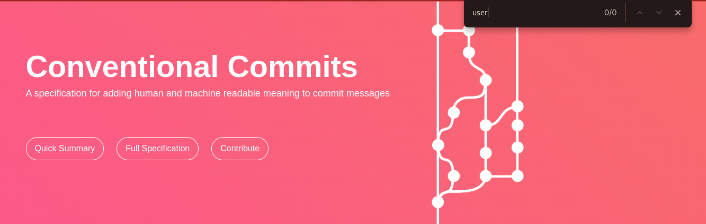
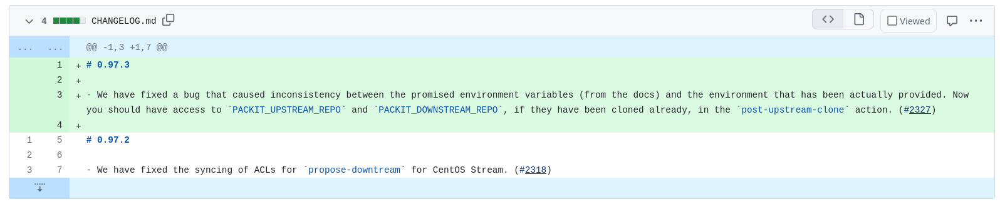
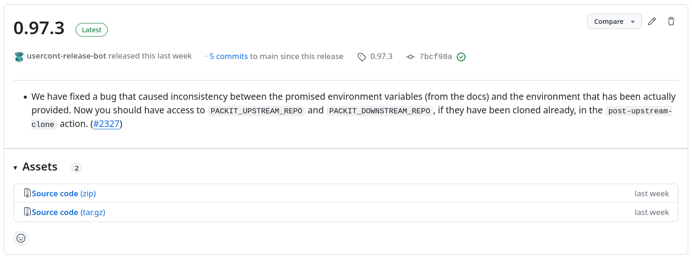

Last month, we had the pleasure of engaging with a dynamic audience during our interactive talk on changelogs at the i[DevConf](https://www.devconf.info/cz/) in Brno, Czech Republic. In case you missed it, you can watch the recording [here](https://youtu.be/TSifrKWNQT0?si=kRlu7PcQZwSwpy0R). Throughout the session, we explored various aspects of changelog usage, including their content, format, and the potential for automation. By asking a series of questions to the attendees, we gathered insights and opinions that highlighted both common practices and divergent viewpoints within the community. In this follow-up article, we aim to summarise the key findings from our discussion, analyse the trends and preferences that emerged, and offer our reflections on the role of changelogs in software development.

<!--truncate-->

## Content

One of the first questions we posed to our audience during the talk was, _"What do you, as a user, like to see in changelogs?"_ The most popular elements that the audience showed to like to see in changelogs were _breaking changes_ and _new features_. Interest in breaking changes indicates that users prioritise being informed about changes that might disrupt their current setup or workflow. As for the features, this shows a strong interest in understanding the latest enhancements and functionalities added to the software. Users appreciate knowing what new capabilities they can leverage. On a similar note, the information about deprecated functionality is also highly valuable for the audience. This can help users plan migrations and avoid using obsolete features. The audience also expressed a clear desire to understand the purpose and context of a new release. Responses such as _"why"_, _"purpose"_, _"reasons"_, _"relations"_, and _"changes motivation"_ highlight this need. Understanding the rationale behind changes helps users comprehend the development trajectory and decision-making process. Another interesting response was the desire to know _"am I affected"_, indicating that users primarily care about whether they need to take action or can safely ignore the update. There was also a response _"not a copy of commit msgs"_. But we will get into that later…

## Formats

The question that followed was, _"What format do you prefer for changelogs?"_ The most popular format by far was _Markdown_. Its simplicity, readability, and widespread use in the developer community make it highly appealing. Markdown's flexibility in formatting and ease of conversion to other formats also contribute to its popularity. This preference may also indicate its frequent use in blog posts or other articles, as Markdown can be easily rendered.

_Plain text_ files were also a prominent choice. We assume this could be for their simplicity and universal compatibility, making them accessible across various platforms and tools.

Other notable formats included _ReStructuredText_, _LaTeX_, _YAML_, and _blog posts_. These formats cater to specific needs, such as enhanced formatting capabilities, structured data representation, or providing more detailed explanations and context. Several unique and creative preferences also emerged, such as _Asciidoc_, _email_, and _PDFs_. This variety of preferences highlights that the needs of different projects and their users vary significantly.

## Tools

Following the format, we’ve tried to collect tooling (if any) used by the audience to help with the changelog management. People mentioned various text editors, IDEs and of course, _chatgpt_/_ai_. But let’s take a look at one specific tool worth sharing:

### towncrier

From [the project’s homepage](https://towncrier.readthedocs.io/en/stable/index.html), _towncrier delivers the news which is convenient to those that hear it, not those that write it._ During a development, _"news fragments"_ (~text files) are created and when there is a new release, one can merge those together. Being user-centric and storing the fragments in git (and being able to review) makes it a really interesting choice worth exploring. Sadly, the pre-commit hooks can’t remind you that you’ve forgotten to add a new _news fragment_. Luckily, there is help in the form of a [Chronographer GitHub application](https://github.com/sanitizers/chronographer-github-app) created by [Sviatoslav Sydorenko (@webknjaz)](https://github.com/webknjaz) (who was by coincidence also present at the talk)

Quite interestingly, 11% of the responders mentioned that no automation is used – there is an opportunity for improvement! (But to be fair, it can also mean that someone from the projects wants to prepare something really useful and do this all by hand.)

There were also some tools like _coffee_, _potato_, _postal pigeons_ or _beer_ that we weren’t able to find documentation for. If you find these, let us know so we can add some links...;-)

There were also various git-based solutions suggested which leads us to the next question:

## Automation based on commit messages

This is a tricky one, right? It might seem like an obvious choice of getting the input for our changelogs. But… yes, there is a “but”. There are two main reasons why one wants to avoid using commit messages for this:

- Commit messages are meant to be read by developers.
- Commit itself represents a change meaningful for developers, not users.

Based on these observations, we came up with the following rules in our team (and talk attendees mentioned the same):

- The content of the changelog should be created for users, not developers.
- Changelog should be created for the user-focused level of change => in our case, pull-request.
- Changelog should be created by the author of the change when the change is being developed.

Of course, one can still use commits for this, but we don’t think it’s a good idea to have two goals for one text. If you really want to go this way, there is a [Conventional Commits project](https://www.conventionalcommits.org/). If nothing else, it can bring more attention to the commit messages and provide well-defined rules for the project contributors. (Talk attendees also mentioned git-cliff as a changelog generator for _Conventional Commits_.) You can also use this format independently to user-facing changelog. (Or, maybe as a base info for a human creating the changelog.) To mention also other responses, there were various git-log based solutions mentioned including the functionality provided directly by git-forges.

## Packit blog-post generator

As a follow-up to the previous questions, we’ve shown a solution we use in Packit. We researched and tried various solutions but this is what finally works for us:

1. When submitting a pull-request, you put your changelog into a pull-request description.

2. If you forget, a GitHub action will mark the PR red to remind you. (You can also put “N/A” if there is no user-facing change and the PR should be skipped for this check.)

3. There is a GitHub action that we manually trigger when a new release should be prepared – as a result, new pull request is created with the aggregated changelog and version being updated.
   When this pull request is merged, the content of the changelog is also put into GitHub release description and from that taken when preparing downstream (i.e. Fedora) updates

4. In Packit, most of our users do not install our packages manually but use our service. When doing a new deployment (by moving stable branches in our repositories), we collect the code snippets and prepare an update post that is published on our project page.

Important bit is that in both ways the changelog snippets are used, there is a review in place. So, you can still revisit the text, combine more entries together or remove if this is not relevant to the user after all.

You can, but don’t need to use the same, but try to think about this, have a discussion within a team. The discussion itself can help you think more about your users.

## Nice changelog examples

Thanks to our fellow attendees, we can share some examples to be inspired by:

- https://github.com/signalapp/Signal-Desktop/releases
- https://github.com/packit/packit/blob/main/CHANGELOG.md (This wasn’t us who suggested this...;)
- https://yarl.aio-libs.org/en/latest/changes/
- https://github.com/systemd/systemd/releases
- https://getgrav.org/#changelog (Nice visualisation!)
- https://cockpit-project.org/blog (Yes, blog posts can be used as well!)
- https://docs.djangoproject.com/en/5.0/releases/5.0/
- https://github.com/ClusterLabs/pcs/blob/main/CHANGELOG.md
- https://qgis.org/en/site/forusers/visualchangelogs.html (Visual changelogs!)
- https://github.com/ksh93/ksh/releases
- https://github.com/Hypfer/Valetudo/releases (screenshots, breaking changes, personal opinions,...)
- https://www.home-assistant.io/blog/categories/release-notes/ (screenshots, a lot of screenshots, deprecations, new plugins,..)

## Space for improvement?

In addition to preferences, we also sought feedback on potential improvements for managing changelogs. The responses highlighted several key areas where the audience sees opportunities for enhancement:

- **AI:** A significant number of responses emphasized the need for AI integration in changelog management, specifically using generative AI for writing changelogs was mentioned.
- **Standardization and consistency:** Several responses called for standardizing the format and content of changelogs. Consistency in how changelogs are written and maintained can improve readability and usability. Specific suggestions included using templates and setting ground rules, such as always including issue IDs in commits.
- **Automation and integration with development tools:** Improving the automation tools and Integrating changelog generation with existing development tools and CI/CD pipelines was another common suggestion. This could streamline the process, ensuring that changelogs are automatically updated and maintained as part of the development workflow.
- **Improving quality:** Improving the quality of changelog messages was a recurring theme. Responses suggested focusing on clear, concise, and meaningful wording and also highlighted the need for changelogs to be more user-oriented rather than developer-centric.

Several responses addressed specific needs, such as differentiating upstream and downstream changelogs, supporting all CI systems, and referencing the tickets associated with changes. Additionally, there were responses emphasizing the importance of keeping changelogs simple and easy to understand.

## Conclusion

And now what?

What you can do now? Improve changelog in your project. Get involved in the project you like and help with the changelogs. Read the changelos.

What we can do together? Let’s collaborate on the tools and share good practices!

And what about the standardisation? Let’s create a new standard! https://xkcd.com/927/

With that, let’s quote a response from one of our attendees:
_"Many more people read the changelog than write it, so it's worth it to put in the effort."_

---

This post was also posted at [medium.com](https://medium.com/@laura.barcziova/do-you-like-your-changelogs-what-devconf-cz-attendees-think-771f51a4e3b0).
