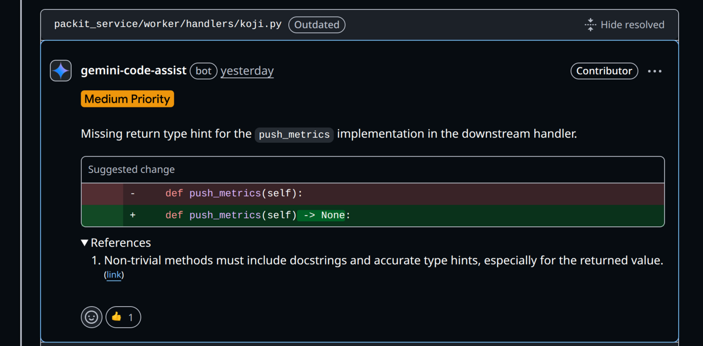

# Our experience with AI-based code review

One amazing benefit that modern LLMs come with is using them as a linter, or a pair programmer. You can easily get feedback on your code: just share it with the AI tool and ask a question. If the feedback is solid, your code is improved. If the feedback is poor, you can just disregard it. But overall with very little effort you can gain a lot.

In this article we are going to focus on code review done with AI tools. We are going to explore a few solutions available as of February 2026 and how they compare based on our experience. This is not a thorough analysis nor are we doing any evals.

<!-- truncate -->

## [Gemini-code-assist](https://github.com/marketplace/gemini-code-assist)

Our AI tool of choice for our upstream reviews is Gemini-code-assist. It's free, easy to set up, and you get to see the comments inside the GitHub interface. Since it's powered by the Gemini models, it can provide solid feedback. If your PR contains clear mistakes, this tool can easily find them. On top of that, we had multiple instances when Gemini discovered subtle issues that were not obvious to the author or a reviewer which turned out to be real problems. Therefore it prevented real bugs from happening in our production environment.

On the other hand, it can be quite opinionated with suggestions that are either irrelevant or don't match your project. That's not strictly a bad thing. Gemini often brings up technical debt and comments on complexity of pull requests. These comments can start a very productive discussion and help the team battle technical debt and invent solutions that can be easily maintained long term.

[Jiri Podivin](https://github.com/jpodivin) recently [contributed a style guide](https://github.com/packit/packit-service/commit/80470bd6c41f49b8fff9950af3e758c64c9df77c) to help Gemini with the reviews. Over the few weeks we only saw a handful of occasions when Gemini would take it into account:



It's possible to run this tool locally in your IDE, but if that's not your local development workflow, it's easier to just open a PR.

But overall, Gemini-code-assist is an amazing tool that is easy to set up, easy to use, it's free and provides real benefit.

## Claude Code

Let's continue with the well known Claude Code tool. It's a full-blown AI agentic system running in your terminal, so it can perform code review easily. You don't even need a fancy prompt, it can be as simple as:

> Perform a thorough code review of our latest work in commit 4b50c430861020216befeecafaebb918ac7bda1f

Claude will inspect the commit and will create a plan for itself with tasks to accomplish the code review. It can look something like this:

```
● Bash(git show 4b50c430861020216befeecafaebb918ac7bda1f --stat)
  ⎿  commit 4b50c430861020216befeecafaebb918ac7bda1f
     Author: Tomas Tomecek <ttomecek@redhat.com>
     Date:   Fri Feb 13 10:38:14 2026 +0100
     … +22 lines (ctrl+o to expand)

● Bash(git show 4b50c430861020216befeecafaebb918ac7bda1f)
  ⎿  commit 4b50c430861020216befeecafaebb918ac7bda1f
     Author: Tomas Tomecek <ttomecek@redhat.com>
     Date:   Fri Feb 13 10:38:14 2026 +0100
     … +395 lines (ctrl+o to expand)

● Thorough Code Review: Commit 4b50c43 "Implement feature foobar"

  🔴 CRITICAL ISSUES

  1. SYNTAX ERROR: Invalid Jinja2 Expression

...
```

The biggest advantage here is that if you are already using this tool (or something similar), it's just a natural part of your development workflow. Claude Code not only reviews your work, but it can also propose changes and even implement them.

This tool can be infinitely helpful, especially if your codebase is easy to navigate, is not colossal, and has solid documentation which Claude can follow.

Several people on the team use Claude Code daily and it is part of our daily job. We've gotten used to it so much that we couldn't live without it, honestly. It's so convenient and helpful. But not everyone is using it, with so many AI tools available, our personal journeys with AI tools adoption are different.

Though not everything it does is perfect and we always need to review its work and update it.

Another huge benefit here is that creating a slash command with precise description and expectations about the review is not hard. Then you can get reviews tailored specifically for you.

We have already started a repository where we gather our Claude Code slash commands: [github.com/packit/internal-ai-workflows](https://github.com/packit/internal-ai-workflows)

## [`ai-code-review`](https://gitlab.com/redhat/edge/ci-cd/ai-code-review)

This is a tool built by a Redhatter [Juanje Ojeda](https://gitlab.com/juanjeojeda). It's a command-line tool that works with multiple AI providers (Gemini, Vertex AI, Anthropic, Ollama) and can perform code review locally or on existing pull requests on GitHub or GitLab.

I love the simplicity: you set it up once and then with a simple command you can have local code review and also set it up in your CI system. If you are a fan of the UNIX philosophy of having a single tool that does its job well, then this is the one.

Here's an example usage for a local change for this blog post:

```
$ ai-code-review --local

📝 Review generated successfully!

================================================================================
AI CODE REVIEW
================================================================================
## Local Code Review

### 🔍 Code Analysis

This merge request adds a blog post about AI-powered code review tools...


### ✅ Summary

**Overall Assessment:** No critical issues identified. This is a low-risk content addition with proper documentation and minimal dependency changes. Minor suggestions provided for content improvements and link verification.


**Minor Suggestions:**
- Consider adding version pinning to requirements.txt for reproducibility (e.g., pygal==3.0.0)
- Verify the February 2026 date in the blog post is intentional and not a typo
- Check that external links (especially github.com/packit/internal-ai-workflows) are accessible to intended readers
- Consider adding alt text description in the markdown for the gemini_ref.png image for accessibility
- The blog post could benefit from a brief mention of evaluation criteria used when comparing the tools

---
🤖 **AI Code Review** | Model: claude-sonnet-4-5

⚠️ AI-generated suggestions may be incorrect. Verify before applying.
```

I've omitted the detailed code analysis section here for brevity, but the summary gives you a good sense of the output quality and structure.

The tool is particularly valuable if you're cautious about sharing data with Cloud providers. You can run a model of your choice locally via Ollama and be completely self-sufficient.

While the summary output is well-structured, as shown above, the full detailed review can be quite verbose. Some additional formatting options (especially syntax highlighting and usage of colors), or the ability to adjust verbosity levels would be helpful for quickly scanning larger changes.

With that said, ai-code-review is a powerful tool that serves its purpose very well. Since it's an open-source project, you're welcome to open issues or contribute improvements.

## Future Exploration

We're aware of CodeRabbit, another well-known AI code review tool, but haven't had the opportunity to evaluate it yet. We may cover it in a future post.

## Conclusion

We've explored three distinct approaches to AI-based code review: Gemini-code-assist for seamless GitHub integration, Claude Code for comprehensive development assistance, and ai-code-review for maximum flexibility.

**Our recommendations:**

- **For quick PR reviews**: Use Gemini-code-assist if you work primarily on GitHub and want zero-friction setup
- **For integrated development**: Use Claude Code if you want an AI assistant that can both review and implement changes as part of your workflow
- **For flexibility and privacy**: Use ai-code-review if you need multi-provider support or want to run reviews with local models

Each tool excels in its domain, and the "best" choice depends on your workflow, privacy requirements, and how you want AI to fit into your development process. The important thing is to start incorporating AI code review into your workflow. Every review comment that AI catches is time and energy your team can redirect toward more valuable work, such as having a cup of coffee.

Even though this article was written by me, Tomas Tomecek, I captured the feedback of all the team members I received over the past several weeks.
