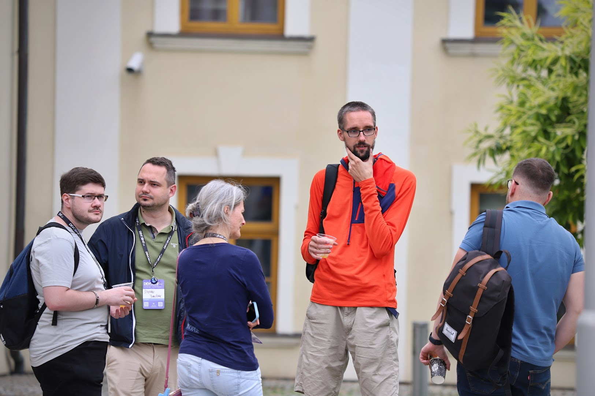
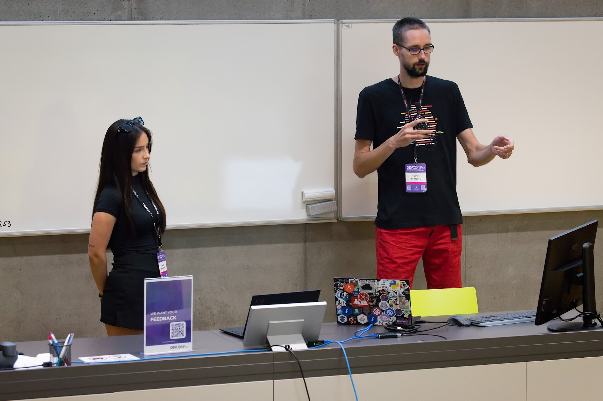

The second part of June is usually quite busy for our team. Why? The last couple of years, this has been a time of [DevConf.CZ conference](https://devconf.cz/). (The unpredictable January had been changed into a more pleasant June.)
Even though the conference is important, it’s used as an opportunity for various people from around the globe to come to Brno and thanks to that, a lot is happening also during the days around.
For the Packit team, it’s a nice opportunity to have the whole team together in one place – we can do some fun teambuilding (like canoeing this year) but also discuss any technical topics or meet our users and realise how are the real people behind all the nicknames. This time we also prepared something for them:

## Packit workshop

Before DevConf, we recognized a unique opportunity: numerous users and potential users of Packit would be visiting Brno for the conference. Therefore, we decided to organise an in-person workshop with a main focus on our release automation. We had previously organised multiple online runs, for which you can find the materials [here](https://packit.dev/docs/workshops-materials), so we were mostly prepared. This initiative brought both Red Hatters and non-Red Hatters, resulting in a rich exchange of ideas and great feedback. In the end, the workshop served not only for learning about our release automation but also about the CI capabilities of Packit in upstream.

During the workshop, several key areas of interest emerged:
Building in Sidetags - There was significant interest in building in sidetags. Participants provided valuable feedback on the workflow and configuration that Nikola Forro is currently developing, see [the GitHub issue](https://github.com/packit/packit/issues/1870). One of the discussion points was the automatic resolution of dependencies as the next step for the current static configuration.
Common specfile manipulation tasks - Participants expressed a need for ways to handle common specfile manipulation tasks, which could be utilised in [Packit's actions](https://packit.dev/docs/configuration/actions) or for debugging purposes. Specific use cases included removing source/patch ranges for Copr builds, replacing sources within specfiles or getting and setting specfile versions. Our [specfile library](https://github.com/packit/specfile) already covers some of these, but besides that, also other alternative solutions were proposed, such as creating a CLI specifically for handling these tasks or adding Packit subcommands to facilitate these operations.

Besides those, in relation to the release automation, some existing issues were brought up, such as the [one](https://github.com/packit/packit/issues/1724) about Packit to not create divergent branches when syncing release. Additionally, a bug/inconsistency was directly addressed and fixed during the workshop, see https://github.com/packit/packit/pull/2327 .

Overall, the workshop was a success and we are happy for our great users for coming! The gained insights will definitely influence the ongoing development and improvement of Packit. We celebrated the successful workshop with a nice lunch together with the participants.

## Packit members talks

Of all the various proposals prepared by our team (and there as a lot!), 3 were accepted and we were able to show some interesting topics to the audience.

The first session was an interactive on hold by Laura and František about changelogs – we used a Mentimer platform to be able to interact with the audience. We could not only collect information what people are interested to see in changelogs or what tooling do they use, but also showed charts from the research Laura made as part of here diploma thesis the last year. As part of the session, we were able to show the changelog automation we use in Packit. There is also [a blog post](https://packit.dev/posts/changelogs) covering the talk and all the interesting findings.

For the next session, František took a bunch of happy (of course..) Packit users and organised a user showcase. In just half an hour 8 people went to stage and provided an introduction to Packit, tmt, Testing Farm and showed 4 interesting usecases. Recording can be found [here](https://www.youtube.com/watch?v=7n8pypmrQh4). Interestingly, the two of the usecases overlayed – Cockpit has introduced their tests-cases into their dependencies to realise issues soon and one of such dependencies is Podman. Both Podman and Cockpit was presented on the stage.

During the third session, Laura and Tomáš showed our journey to team role rotation and how we do this these days. They used Mentimer as well as for the changelog one so it was a great fun. Missed it? No worries, there is no only a [recording](https://www.youtube.com/watch?v=y1t7Wd31bL8), but also [a blog-post serie](https://packit.dev/agile/weekly-roles) covering this topic. [The last part](https://medium.com/@laura.barcziova/role-rotation-tutorial-957ed3545ef2) helps you do the same, and as usual, we have this automated…

## Talks related to Packit

Even though some of our talk proposals were not accepted this year, our users represented us very well. In addition to the previously mentioned user showcase), there were two other dedicated talks by Packit users:

- **Shifting Left in Podman with Copr, Packit, and TMT** - In this talk, Mohan Boddu described how they utilise Packit, Copr, and TMT to shift their testing setup and test early in the process. This talk also included a short live demo. (https://pretalx.com/devconf-cz-2024/talk/WVNJZS/)
- **Upstream Cross-Project Testing: Never Break Your API Consumers** - In this talk, Martin Pitt from the Cockpit team described the use case of reverse dependency testing (https://packit.dev/docs/cross-project-testing) using Packit. (https://pretalx.com/devconf-cz-2024/talk/KDZZES/)

Additionally, Siteshwar Vashisht presented about OpenScanHub, a service for static analysis of Linux distributions, where he also mentioned Packit and [our plans](https://github.com/packit/packit-service/issues/2107) for integration (https://pretalx.com/devconf-cz-2024/talk/7C38GJ/).

---

So, that was it. A DevConf week we enjoy being part of same as enjoying it being over.
