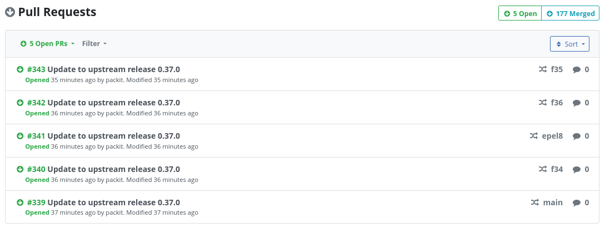
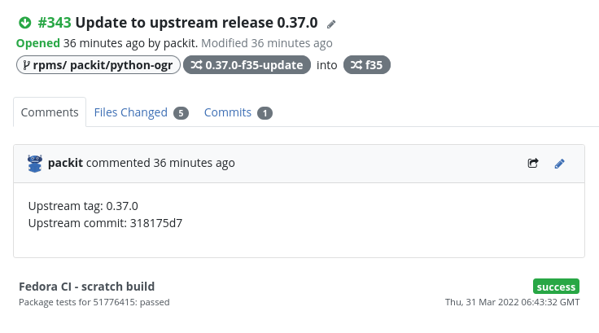
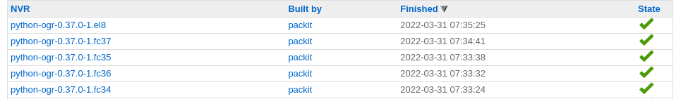
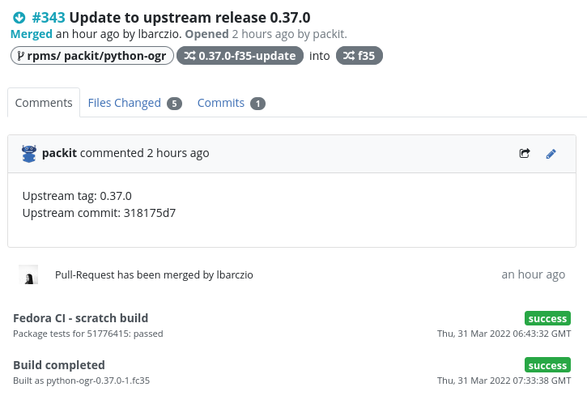
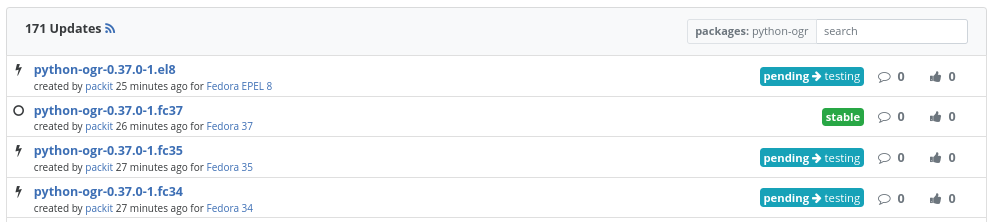
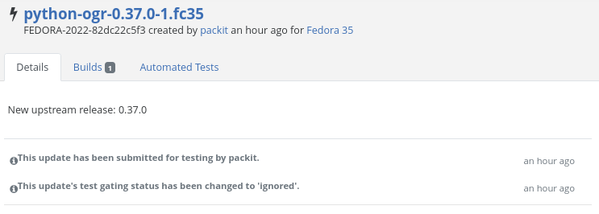

# Downstream automation is here

Finally, it's here. Now, you can do the whole Fedora release with the help of Packit.
Let's take a look at how it works on an example of [OGR](https://github.com/packit/ogr), the Python library we develop.

<!--truncate-->

## Upstream

The process of releasing a new version starts in the upstream repository.
Here, we can see an upstream release:


## Propose downstream

As the first step on our way to Fedora users, we need to get the new upstream release to the Fedora dist-git.
This is what we call `propose-downstream` job.
Here is a snippet from the config file of OGR:

```yaml
downstream_package_name: python-ogr
copy_upstream_release_description: true

jobs:
  - job: propose_downstream
    trigger: release
    dist_git_branches:
      - fedora-all
      - epel-8
```

How does the `propose-downstream` work?
As a first step, the archive is saved to lookaside cache
and after that, Packit updates the dist-git content (mainly `sources` file and spec-file)
via pull-requests for the specified branches. (Direct push is possible only for CLI by setting a
[`create_pr` option](https://packit.dev/docs/configuration/#create_pr) to `false`.)

If you use [`copy_upstream_release_description: true`](https://packit.dev/docs/configuration/#copy_upstream_release_description),
as in the config above,
the changelog entry will use the GitHub/GitLab release description field.
(Just make sure the formatting is compatible with spec-file.
E.g. use `-` instead of `*` for lists to not create multiple changelog entries.)

And how is it triggered?
Packit gets the information about the newly created release from GitHub/GitLab (via webhook),
loads the config from the release commit and if there is a `propose-downstream` job
defined, the workflow begins.

Here are the pull-requests created by Packit:



And here are the details of the one created for `f35` branch:




Now, it's on downstream CI systems and maintainer to check the changes and merge
the pull-request.

## Koji

If Packit sees a new commit in the configured dist-git branch, it submits a new build in Koji
like maintainers usually do. (The commits without any spec-file change are skipped.)



Here is a job definition for the package we use as an example:

```yaml
jobs:
  - job: koji_build
    trigger: commit
    dist_git_branches:
      - fedora-all
      - epel-8
```

There is no UI provided by Packit for the job,
but it is visible across Fedora systems (like you can see in the following image)
like a manually created Koji build and you can utilise
[Fedora Notifications](https://apps.fedoraproject.org/notifications/about)
to get informed about the builds.



## Bodhi

Once Packit is informed (via fedora-messaging bus) about the successful Koji build,
it creates a new update in Bodhi for you.



Here is a job definition:

```yaml
jobs:
  - job: bodhi_update
    trigger: commit
    dist_git_branches:
      - fedora-branched # rawhide updates are created automatically
      - epel-8
```

The packit config is loaded from the commit the build is triggered from.

Here is an example of the resulting Bodhi update:



And that's all. The rest is on the users and maintainers to give the update enough Karma
so the update gets to the users.

## Conclusion

Does it look simple? Yes, it is. We try to automate
as much as possible but still leave the space for human intervention where it is needed --
pull-request review and verification of the Bodhi update.
Of course, in case of some errors, a human can (and should)
replace the work of a bot.
Other manual, mundane and waiting tasks are replaced by Packit.

Please, try it yourself and let us know what do you think.
Those jobs are really new and some issues might occur.
But we will try to fix those and if you have any suggestions
for improvement, please, [create an issue](https://github.com/packit/packit-service/issues/new/choose) so we can
see if the request is doable and we can try to implement it.
And of course, code contribution is more than welcome as well.
