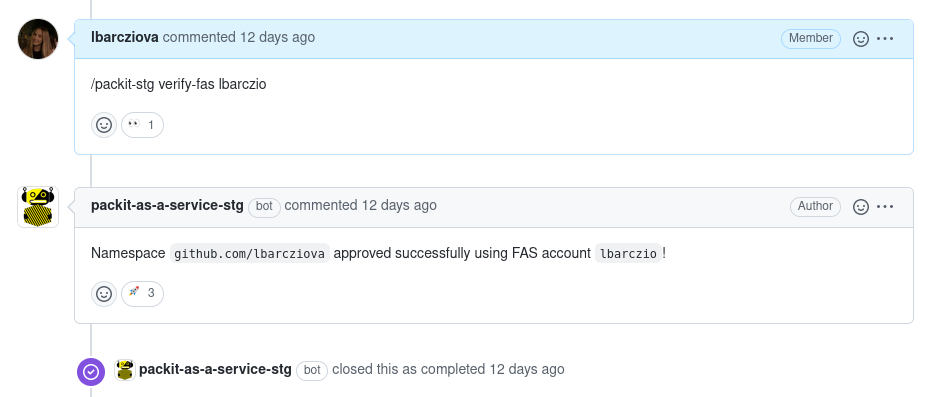

As you may already know, for using Packit Service
GitHub App we [require our users to have a valid Fedora Account System account](/docs/guide/#2-approval).
We were verifying the newcomers until now manually, but in recent weeks, we have implemented an automated solution
for it. Let's take a closer look at how it is done currently and what have we improved!

<!--truncate-->

Formerly, the process of verification by us started by waiting for the users to provide
us their FAS username, then checking whether the provided FAS account
exists and matches, and finally, manually adding the account to our allowlist in the database. For the communication with
new users, we have used our [`packit/notifications`](https://github.com/packit/notifications/issues)
repository on GitHub where we created an issue for each new installation.

Although in general, this worked, it required human interaction and since we are not available 24/7, the verification wasn't immediate.
We wanted to simplify the process for both users and us.
Since in FAS, everyone can set their GitHub login that is then publicly available, we decided to utilize this setting.

So how does the verification work now?

For each new GitHub installation, we first check whether there isn't a FAS account with the same login as the one
that triggered the installation. If we find such an account, we check whether the `GitHub Username` in this FAS account matches
the GitHub login of the one that triggered the installation. To get the information about the FAS accounts, we
use the [`fasjson-client` library](https://github.com/fedora-infra/fasjson-client).
If this check doesn't prove any match, we create an issue in the
`packit/notifications` repository as previously. This is what it looks like:

As you can see, it contains instructions on how to trigger the verification automatically. So, everything the person who installed the app needs to do is set the `GitHub Username` field in their FAS account (if they don't have it set
already) and then provide the FAS login via Packit comment command `/packit verify-fas the-fas-account`.

Once the user does this, our service runs the same verification again (with the FAS username provided in the command) and informs users about the status
via a comment in the same issue. The successful verification looks like this:

This should save both users and our time and hopefully make the onboarding process smoother for the newcomers.
Since this is a pretty new feature,
let us know whether there is something that is not clear so that we can improve it.
