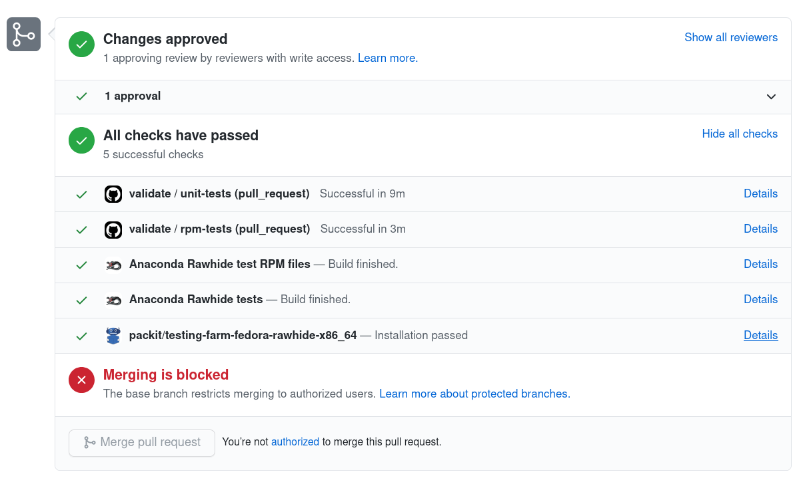

[Fedora EL Niño](https://docs.fedoraproject.org/en-US/eln/) (ELN) is such an
awesome idea. It enables building rawhide packages in two distinct buildroots:

1. the standard Fedora Rawhide buildroot and
2. a second one, which mimics Red Hat Enterprise Linux

This way you can make sure that your new upstream release builds fine in the
next RHEL.

But this feedback might be a little bit too late: the upstream
release already happened and the code was imported in Fedora dist-git, so
fixing an issue will require repeating the whole process. Wouldn't it be better
to know if the upstream change builds fine in ELN **while** working on the
code?

Oh, wait!

### You can do this easily with Packit

If your GitHub project is not using Packit yet, [here's a
guide](https://packit.dev/docs/guide) how to start.

Once it's set up, you need to make sure that your pull requests are also being
built in the `fedora-eln` target:

```
jobs:
  - job: copr_build
    trigger: pull_request
    metadata:
      targets:
        - fedora-development
        - fedora-eln
```

With this config, changes from every pull request will be built in all
development versions of Fedora (at the time of writing this, it's Rawhide and
Fedora 33) and in Fedora ELN.

Easy, right?

Packit can also trigger builds when you push to a branch. If you want to have
up to date builds of your main branch for ELN and development versions of
Fedora, here's how to set it up:

```
jobs:
  - job: copr_build
    trigger: commit
    metadata:
      targets:
        - fedora-development
        - fedora-eln
      branch: main
```

### A real-life example

If you got here and you're still not sure why you'd need this, I can give
you a real-life example.

Recently, [Jirka Konecny](https://github.com/jkonecny12) from the RHEL
Installer team reached out to us that they would love to use Packit as a CI
system. He set it up and now all the anaconda PRs are being built and tested on
`Fedora Rawhide x86_64`.



Jirka continued and added Fedora ELN as an additional target. The build failed
because one of build requirements was not available in ELN:

```
Fedora ELN - Developmental modular packages for the next Enterprise Linux release               2.7 kB/s | 2.3 kB     00:0
No matching package to install: 'metacity'
Not all dependencies satisfied
Error: Some packages could not be found.
```

Since the team discovered this during their upstream development process, they
can react to the issue right away. It would have been pretty late if they found this
while the next major RHEL is reaching alpha - at this moment they should
have enough time to fix the problem and make sure anaconda builds fine in ELN.

So, are you convinced? Let us know if you need help setting up Packit in your
upstream repositories :)
