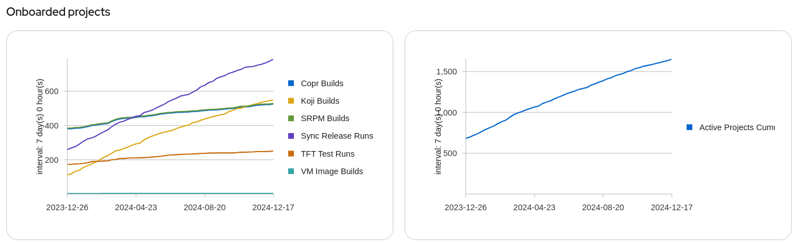

# Packit in 2024

We are reaching the end of the year and it’s a good time to look back at the Packit highlights of this year. And it was a year!

We didn’t take a winter sleep, and at the very start of the year, we [announced](https://packit.dev/posts/specfile-introduction) the [Python library for parsing specfiles](https://github.com/packit/specfile). (Mainly written by [Nikola](https://github.com/nforro).) We had been successfully using it for some time and it was time to give the benefit to others. Thanks to that, there is now a [language Server for RPM spec files](https://github.com/dcermak/rpm-spec-language-server).

A lot usually happens in Brussels at the turn of January and February. And this time, we were present as well for the first time. [František](https://mastodonczech.cz/@lachmanfrantisek) (joined by [Evgeny](https://github.com/ukulekek)) presented on [CentOS Connect how Packit and Testing Farm can be beneficial to the CentOS community](https://www.youtube.com/watch?v=Eqb6IqG7Jek). Also, at this conference, there was a meetup of the [CentOS Integration SIG](https://sigs.centos.org/integration/) which [Matej](https://fosstodon.org/@m4tt_314) and [František](https://mastodonczech.cz/@lachmanfrantisek) joined. The main event in Brussels is the [FOSDEM conference](https://fosdem.org/2024/), a big conference consisting of multiple so-called rooms. [František](https://mastodonczech.cz/@lachmanfrantisek) took [an interactive session](https://fosdem.org/2024/schedule/event/fosdem-2024-2881-upstream-and-downstream-best-friends-forever-/) in the Distribution room about the relationship between upstream and downstream.

During the whole year, we have made many improvements so more packages can use Packit’s Fedora release automation. Since many packages can benefit from Packit right away, we’ve introduced an [onboarding command](https://packit.dev/docs/cli/dist-git/init) capable of preparing a configuration file and also moving it to dist-git – either via pull requests or direct push.

For some time, Packit has been able to build VM images thanks to the prototype integration with the [Image Builder service](https://console.redhat.com/insights/image-builder). To promote this functionality and see if there is enough demand to continue development, [Maja](https://github.com/majamassarini) prepared a [blog post](https://developers.redhat.com/articles/2024/04/02/customize-aws-cloud-images-rhel-image-builder-and-packit#) for RedHat’s Developer Portal (also [available](https://packit.dev/posts/aws-and-image-builder) on Packit’s webpage).

As each year, the team met in person in June in Brno – both to gather and discuss Packit-related topics and also to be part of DevConf.CZ conference. To not need to dive into everything happening during that time in this text, take a look at [our blog post](https://packit.dev/posts/devconf-2024). We organised a successful workshop in the Red Hat Brno office and took multiple talks, notably a [showcase](https://www.youtube.com/watch?v=7n8pypmrQh4) of user success stories presented by our fellow users.

During summer and again after a couple of years, we had the pleasure to have a student working on a Packit-related task as part of the Google Summer of Code. This time, the functionality was going outside of the Fedora ecosystem, namely to support OBS (the openSUSE build and distribution service). We want to thank [Brian Elle](https://github.com/rxbryan) who worked on this, and [Dan Čermák](https://github.com/dcermak) who took the lead on this from the openSUSE side and is currently polishing the code so it can be introduced into Packit’s codebase without worrying about maintainability.

Another regular event during the year is a Fedora yearly conference – [Flock](https://fedoraproject.org/flock/2024/). This time happening in Rochester and thanks to Fedora’s sponsorship, both [Laura](https://fosstodon.org/@lbarcziova) and [František](https://mastodonczech.cz/@lachmanfrantisek) could take part. Similar to DevConf.CZ we’ve covered all the details in a [separate blog post](https://packit.dev/posts/flock_2024_diary). Just to mention the talks presented, we took [one](https://cfp.fedoraproject.org/flock-2024/talk/HCBLBX/) session covering Fedora automation and our journey to it and a [second one](https://cfp.fedoraproject.org/flock-2024/talk/SHQHK8/) with [Jan Havlín](https://matrix.to/#/@jhavlin:fedora.im?web-instance%5Belement.io%5D=chat.fedoraproject.org) from the Testing Farm to show people various testing use cases and all the news that was delivered on this field.

The second half of the year was spent finishing all the initiatives we’d worked on for some time. The long-awaited feature was not to require a git upstream for Fedora release automation. This wasn’t so simple because of the old decision to build Packit on the concept of related git repositories – one representing upstream and one downstream. (And maybe one for the source-git, but that’s a [story](https://packit.dev/source-git/status) for another time.) Luckily, all the hard work was done and many packages can now use Packit.

Another feature and another change of Packit’s internal plumbings is the way to [avoid having divergent branching](https://packit.dev/posts/non-git-upstreams-support) when releasing to multiple Fedora (or EPEL) branches. Thanks to this, the commits between branches can now be shared and the history can be linear.

This is still not all. Another huge feature spreading across multiple packages is [the support for side-tags](https://packit.dev/docs/fedora-releases-guide/releasing-multiple-packages). It’s a vast improvement and enabler for various package groups that need to control many packages together. And it’s finally there!

And this is still not all for this year. We love collaborating on features and one such collaboration was/is with [Siteshwar Vashisht](https://fosstodon.org/@siteshwar) on integrating Packit with [OpenScanHub](https://openscanhub.dev/) so Packit users can run static analysis without much effort. Later during the year, we managed to properly report differential scans (so you can check only new findings.) If you are interested in this (or would like to know why one needs to care), look at Situ’s presentation on [DevConf.CZ](https://www.youtube.com/watch?v=rcuIvAttWgY&pp=ygUdZGV2Y29uZiBzaXRlc2h3YXIgb3BlbnNjYW5odWI%3D) or [Cauldron](https://www.youtube.com/watch?v=lp7UECNg7qY) conference. You can also visit Brussels next year and [František](https://mastodonczech.cz/@lachmanfrantisek) and [Siteshwar Vashisht](https://fosstodon.org/@siteshwar) [should present](https://cfp.fedoraproject.org/centos-connect-2025/talk/review/EW7PWKP8E3FJPVYHUTARFZRNURYZBTDA) the integration on the [CentOS Connect](https://connect.centos.org/). Feedback for this functionality is welcome [here](https://github.com/packit/packit/discussions/2371).

After all these big achievements and many small and big improvements, the [time has come to release Packit v1.0.0](https://packit.dev/posts/packit_1_0_0_action_required). Everything is now prepared, and we are giving people time to update their configuration files. (Since we love automation and pull request-based workflows, the affected users should have received a pull request with the changes required.)

So, quite a strong year, wasn’t it?

If you rather want to check some hard data, let’s look at the usage trend charts from last year. We’ve managed to double the number of projects! As you can see, there is a strong trend in the Fedora automation space overnumbering the projects with upstream Copr builds and/or tests.

And now, we are slowly moving towards the next year. So, what you can expect from us?

We have two ideas on how to have a bigger impact (a positive one, we truly believe) in Fedora. Since we believe Fedora is about community, we have prepared two Fedora Change Proposals so everyone can provide feedback on what we would like to introduce.

- [F42 Change Proposal: Automated onboarding to Packit release automation for new packages (system-wide)](https://discussion.fedoraproject.org/t/f42-change-proposal-automated-onboarding-to-packit-release-automation-for-new-packages-system-wide/139530) (Yes, we would like to bring Packit to new packages and ideally to people who might not be aware of Packit.)
- [Packit as a dist-git CI](https://fedoraproject.org/wiki/Changes/PackitDistgitCI) (We believe we can build on our successful collaboration with Testing Farm and provide a better dist-git CI for Fedora.)

We would also like to give our dashboard more love. We used to prioritise other features, but we can’t postpone it forever. With the help of [Freya](https://snug.moe/@Venefilyn), we plan to start with user research and try to make the dashboard more user-friendly as part of [Project Mycorrhiza](https://packit.dev/posts/project-mycorrhiza).

To be closer to Fedora, we would also like to move our deployments to the Fedora OpenShift Cluster. The discussions are ongoing, and luckily, we might be able to do this soon.

And if you want to meet us in person, a good chance is [CentOS Connect](https://connect.centos.org/), [DevConf.CZ](http://DevConf.CZ) or [Flock](https://fedoraproject.org/flock/).

Hopefully, the following year will be at least as successful as the previous one. Thanks everyone for your support. We have the pleasure to have a friendly and grateful userbase that is a pleasure to work with and for. All the best for the new year!
