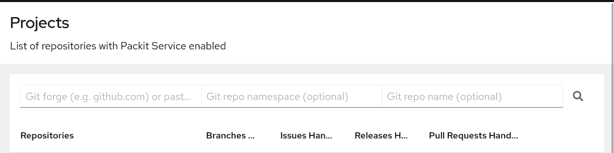

This term has been thrown around a bit in issues here and there relating to the dashboard and
people usually get confused, and rightfully so! Lets dive in and see what Project Myccorhiza
is and why we chose this name.

Photo by [Malene Thyssen](https://commons.wikimedia.org/wiki/User:Malene) - Own work, [CC BY-SA 3.0](http://creativecommons.org/licenses/by-sa/3.0/ "Creative Commons Attribution-Share Alike 3.0"), [Link](https://commons.wikimedia.org/w/index.php?curid=752225)

<!--truncate-->

---

[TL;DR at the bottom!](#tldr)

Before I explain what Project Mycorrhiza is and what it's about, lets talk about
the Packit dashboard and why it's been getting so much love from me the past year.

It's to no surprise that Packit is used within a lot of different projects around
Fedora, which includes [Convert2RHEL](https://github.com/oamg/convert2rhel) that I'm
a developer of. But I've always felt like Packit's dashboard has missed the mark on
being the go-to for getting an overview for the pipeline, results, or even the
project itself.

Since I like making websites better for my own benefit, I've spending a huge amount of my own
time the past year to gradually improve the Packit dashboard to prepare it for something
bigger. Which is where Project Mycorrhiza comes in.

## What's mycorrhiza and mycorrhizal network?

:::note

This is heavily simplified for the purpose of getting a quick overview. I encourage you
to read more about [mycorrhiza on the wikipedia article about it](https://en.wikipedia.org/wiki/Mycorrhiza)
and any related articles!

:::

You might be familiar with something called mycelium, the network of root-like structures that
fungi form. I'm assuming most of you have seen this form on food before, such as bread
that grew mold.

The mycelia helps fungi get nutrients and get enough food to grow mushrooms!
Some are just terrible to be around, some are interesting to look at but relatively toxic, and
some are even edible. Those same labels I applied to the mushrooms are something plants and trees
sort of do as well!

A mycorrhizal network is a symbiosis between fungi and flowers and trees.
You have already seen one too as the photo above is a bunch of Beech trees that
are "[ectomyccorhizal](https://en.wikipedia.org/wiki/Ectomycorrhiza)"!
What it means is that nutriets are shared between the two, the fungi spreads out mycelia in the soil
and transfers nutrients to the tree, and the tree provides sugar and fat back to the fungi.

Since my project relates to integrating more services and getting a better
packaging ecosystem, I chose the name Project Mycorrhiza to put emphasis on symbiosis between
the different tools.

## Project Mycorrhiza

Now with the name explanation out of the way. First and foremost, this should be seen as a kind
of idea or kind of a temporary working group to see about the future goals of Packit and
how the Packit dashboard fits into the Fedora service ecosystem. The Mycorrhiza name itself
will only stick around for the duration of this investigation and alignment. Once it is done
we will likely drop or change it.

### Fedora packaging ecosystem

There is a lot of packages out there that ships in Fedora, be it through Copr repositories or
official Fedora repositories. But what they most have in common is a continuous integration
workflow to ensure that they can release whenever they want. Although Packit helps with this
tremendously, it's only an orchestrator to make the process easier and more automated.

For those that already ship to Fedora, you likely use Copr to do either general releases or just
to do development builds to test on. Packit can ensure that new commits

1. Start a Copr build for the commit with a good name.
2. Kicks of integration tests through [Testing Farm](https://testing-farm.io/).
3. Show the results in GitHub or GitLab workflows.

Packit can do a whole bunch more than just this and even go into finer granularity, making it
a very powerful service to use when it comes to packaging. However, when it comes to
debugging or seeing results of tests. Packit in the current state rarely does anything more than
providing links to the results in Copr, Koji, Testing Farm, and so on.

### Next-generation dashboard

This is where I see the most improvement for consolidating this information. There is so much
we could do and I can see so many fun projects given the currently small scope of the Packit
dashboard. But we need to focus first and foremost on what users want, and although I have
a strong belief I know what would be good, everything mentioned here will need to be followed-up
with user interviews and general opinions from users before long-term initiatives will be worked on.

One of the first thing I noticed when I was onboarded to Packit with Convert2RHEL was the lack of
project overview. I wanted to see how builds and tests throughout all PRs were doing on the project
and ideally getting results without having to leave the page. Instead, I found an undeveloped
project page, a pipeline view that showed all pipelines, individual result pages with links
to build logs and test results.

That theme grows abundant throughout the dashboard as well and indicates so much room for
improvement.

#### Incorporating services into Packit dashboard

To reduce the context switching I've experienced throughout it would be great to incorporate
information (and potentially actions) from other services such as Copr and Testing Farm.

In particular, both Copr and Testing Farm provide logs to how things went. We have the potential
here to not only include the logs, but improve the workflow through the use of the existing
Packit pipeline.

We could load logs, parse them for relevant information, follow-build logs (this is dependent on
third parties mostly), and even see about providing notifications on the go for when the results
are in.

Copr has an API that can be utilized for this, and so does Testing Farm, which is how they
provide results to their own Testing Farm results page.

Having all of these logs in one section and in particular a unified style would be super
beneficial to avoid having to re-parse things.

Log Detective, a project to help parse logs and provide information on why builds failed, can
also be integrated to help their project get more logs to train with (opt-in of course).

#### Product overview

If you manage a product and for instance use Testing Farm you know the pain of waiting for the
results to happen. Especially so when you are waiting on test runs within several PRs/MRs.

Getting a better view for the project view to display all the pipelines for the repository
would not only help get a holistic view for how things are going, but allow you to instantly
see and even be notified of the results.

#### Filters, search, & sorting

In the current Packit dashboard you can even see a what's supposed to be search field that
allows you to search for the forge (like GitHub), git organizations, and git repositories.
If you've tried to use this you've quickly realized this needs an exact name and is more of a
"quick-link" to the respective view than a search.

What is seen in most other tables throughout as well, including the project view, is that we
don't have any filters available. The sorting is also done by most recent first, but what if
you want to sort by PR for example? That is missing in the current implementation.

Having a search to get the results quickly would also be good, which would be similar to filter
but just a free-form field basically.

## Research and interviews

So what's next? There is a lot of great information out there already, such as interviews
by the Red Hat UXD team. We will be going through data reported for the general lacking features
developers want or are frustrated with, as well as following-up with Packit users with a more
Packit-scoped interview to see how on the goal our research is. Depending on this research, which
we hope to be done beginning of 2025 in a worst-case scenario, we will start to plan out
what needs to be done to make Packit service and Packit dashboard be the best it could be.

We will of course continue to improve everything until then, Packit dashboard will get gradual
improvements throughout rest of the year and Packit will continue to work on the goals they've
announced for the quarter.

## TL;DR

Project Mycorrhiza is a temporary name to encompass the work relating to what the next generation
Packit dashboard could look like by seeing how developer time can be saved, minimizing
complexity, reducing context switching, and providing results faster. Research going into this
will likely improve Packit service as well. 'Mycorrhiza' means a symbiotic network between plants
and fungi to share nutrients, fats, and sugars between each other to grow.

We are working on and will within the quarter consolidate existing research and begin to interview
more teams to gather data on what developers are missing the most.

## Links

- [Pitch for NextGen Packit Dashboard.pdf](assets/Pitch%20for%20NextGen%20Packit%20Dashboard.pdf)
