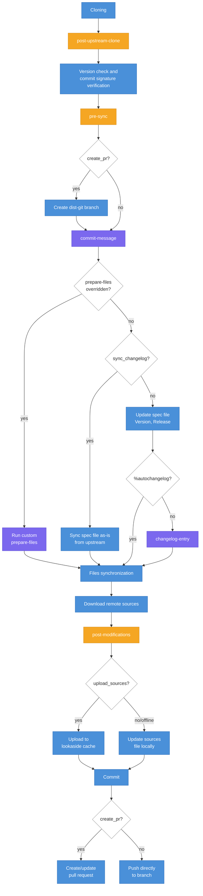

In Packit, release synchronization is the process of landing an upstream release in a dist-git
repo. Let's take a look at how the process works under the hood and how you can customize it.

First, let me define some terms:

- [`propose_downstream`](/docs/configuration/upstream/propose_downstream) - release sync
  job triggered by an upstream release, configured upstream
- [`pull_from_upstream`](/docs/configuration/downstream/pull_from_upstream) - release sync
  job triggered by a [release-monitoring.org](https://release-monitoring.org) event,
  configured in dist-git
- action - list of commands that can replace the default Packit implementation of a certain step
  of the process
- hook - action that does nothing by default
- source - source defined in the spec file, either as a `Source`/`SourceN` tag or as
  a `%sourcelist` entry
- remote source - source defined as a URL

<!--truncate-->

`propose_downstream` and `pull_from_upstream` share most of the implementation. One notable
difference is that `pull_from_upstream` always uses the downstream spec file as a base for
the update, even if there is an upstream spec file.

## Cloning

As the first step, Packit clones git repositories, both upstream and dist-git. If you are
running `pull_from_upstream` with no
[`upstream_project_url`](/docs/configuration#upstream_project_url) then there is no upstream
repository and only dist-git is cloned. Environment variables `PACKIT_UPSTREAM_REPO` and
`PACKIT_DOWNSTREAM_REPO`, which are available to you in actions, contain paths to the
respective local clones, `PACKIT_UPSTREAM_REPO` also being the working directory in
the actions. If there is no upstream repository, `PACKIT_UPSTREAM_REPO` is not set and
the working directory for actions (exposed as `PACKIT_PWD`) is an empty temporary directory.

At this point, proposed version and release tag are determined. Proposed version, available
to you in actions as `PACKIT_PROJECT_VERSION`, comes from an upstream release
(`propose_downstream`), a [release-monitoring.org](https://release-monitoring.org) event
(`pull_from_upstream`), or it can be provided as a CLI argument. Release tag is derived from
the proposed version using
[`upstream_tag_template`](/docs/configuration#upstream_tag_template).

After cloning, the upstream repository, if any, is checked out at the release tag. The
dist-git repository is switched to the branch for which the current job runs.

If the proposed version is lower than the version already in the downstream spec file, the
synchronization is aborted.

## `post-upstream-clone` hook

This is the first hook that is being run. As it is a hook, Packit does nothing by default,
but you can use it to modify files in the upstream or downstream repository before the
synchronization begins. For example, you could generate a spec file, modify sources, or run
a build system command that produces files needed later.

## Version check and commit signature verification

The proposed version and the version in the upstream spec file are both matched against
[`version_update_mask`](/docs/configuration#version_update_mask) (if configured) and the
synchronization is aborted if the matches differ. Note that this check only applies to
branched Fedora and EPEL, not Rawhide. Similarly, if
[`version_update_specifiers`](/docs/configuration#version_update_specifiers) is configured,
the proposed version is checked against it and the update is aborted if it doesn't match.

The head commit in the dist-git repo is then verified against
[`allowed_gpg_keys`](/docs/configuration#allowed_gpg_keys) (if configured). If the commit
is not signed by one of the allowed keys, the synchronization is aborted.

## `pre-sync` hook

This hook runs after the version and signature checks but before any files are modified.
This is your last chance to make changes before the actual synchronization begins.

## Dist-git preparation

When [`create_pr`](/docs/configuration#create_pr-only-in-cli) is enabled (the default),
Packit creates a new branch in the dist-git repo from the current branch, resets the working
directory and rebases onto the target branch. All changes will be made on this branch and
submitted as a pull request.

## `commit-message` action

Before starting the actual file synchronization, Packit evaluates the `commit-message`
action. If you have defined this action, the stdout of your commands is captured and parsed
as the commit message. Everything after `PACKIT_DEBUG_DIVIDER` is used (so you can print
debug output before it). The first paragraph becomes the commit title, the rest becomes the
commit description.

If you haven't defined this action, Packit uses a default commit message:

```
Update to {version} upstream release

- Resolves: {bug}           # for each resolved Bugzilla bug, if any

Upstream tag: {tag}         # omitted if there is no upstream git repo
Upstream commit: {commit}   # omitted if there is no upstream git repo

Commit authored by Packit automation (https://packit.dev/)
```

Note that this action is evaluated before `prepare-files`, so the commit message is
determined early in the process. However, it has access to all the version and tag
information it needs. See the
[documentation](/docs/configuration/actions#commit-message-1) for available environment
variables.

## `prepare-files` action

This is the most important action in the sync release process. It controls how the spec file
is updated.

### Default behavior

When not overridden, Packit does the following:

If [`sync_changelog`](/docs/configuration#sync_changelog) is set to `true`, the spec file is
synced as-is from upstream, including its `%changelog` section. No special changelog handling
is done. Otherwise, Packit copies the upstream spec file content to the downstream spec file
but preserves the downstream `%changelog` section. It then:

- Updates the `Version` tag to the new version.
- Determines and sets a new `Release` value (typically resetting it to `1` for
  a new version).
- Adds a new changelog entry (unless the spec file uses `%autochangelog`, in which case no
  manual entry is needed).
- Removes the upstream spec file from the list of files to sync, so that the rsync step
  that follows doesn't overwrite the carefully constructed downstream spec file.

The changelog entry text comes from the `changelog-entry` action (see below) or defaults to
`"- Update to version {version}"`. If there are resolved Bugzilla bugs and no custom
`changelog-entry` action, `"- Resolves: {bug}"` lines are appended. The entry can also be
overridden by
[`copy_upstream_release_description`](/docs/configuration#copy_upstream_release_description)
(see `changelog-entry` below).

### When overridden

If you define a custom `prepare-files` action, all of the default behavior described above
is skipped. For `propose_downstream`, keep in mind that the upstream spec file will still be
synced by the rsync step that follows, so avoid modifications to the downstream spec file
until after the synchronization. This is generally not a concern for `pull_from_upstream`,
unless [`upstream_project_url`](/docs/configuration#upstream_project_url) is configured and
the upstream repository contains a file at the same path as
[`specfile_path`](/docs/configuration#specfile_path) — in that case, rsync would overwrite
the downstream spec file as well.

## `changelog-entry` action

This action only runs if `prepare-files` is not overridden,
[`sync_changelog`](/docs/configuration#sync_changelog) is not set to `true` and the
downstream spec file doesn't use `%autochangelog`.

When defined, the stdout of your commands is used as the changelog entry text. When not
defined, the default entry `"- Update to version {version}"` is used.

If [`copy_upstream_release_description`](/docs/configuration#copy_upstream_release_description)
is set to `true` and there is an accessible upstream git forge, the release description from
the upstream release is used as the changelog entry instead, regardless of whether a default
or custom entry was produced (but not if `%autochangelog` is used).

See the [documentation](/docs/configuration/actions#changelog-entry) for available
environment variables.

## Files synchronization

After `prepare-files` completes, the files listed in
[`files_to_sync`](/docs/configuration#files_to_sync) are copied from the upstream repository
to the dist-git repository using rsync. By default,
[`files_to_sync`](/docs/configuration#files_to_sync) includes the spec file and the Packit
configuration file. If you configure
[`files_to_sync`](/docs/configuration#files_to_sync) explicitly, only the files you specify
are synced.

As mentioned above, when the default `prepare-files` behavior runs (and
[`sync_changelog`](/docs/configuration#sync_changelog) is not set to `true`), the spec file
is removed from this list. When
[`sync_changelog`](/docs/configuration#sync_changelog) is `true` or when `prepare-files` is
overridden, the spec file remains in the list and is synced as-is.

## Download of remote sources

After files are synced, Packit downloads source archives. This includes:

- Sources defined in the `sources` configuration option in Packit config
- Sources from the lookaside cache (listed in the `sources` file in dist-git)
- All remote sources and patches (URLs) defined in the spec file

## `post-modifications` hook

This hook runs after sources are downloaded but before uploading anything to the lookaside
cache. It does nothing by default.

This is useful if you need to modify any files after all the spec file updates and source
downloads are complete. For example, you could patch a source archive or generate additional
files.

## Upload to lookaside cache

After the `post-modifications` hook, Packit determines what source archives defined in the
downstream spec file need to be uploaded to the lookaside cache. Archives tracked by git in
the dist-git repository are filtered out. Of the rest, any archive missing from the cache or
from the `sources` file in dist-git is included. If there is anything to upload, Packit
initializes a Kerberos ticket and runs the equivalent of `fedpkg new-sources`.

If [`upload_sources`](/docs/configuration#upload_sources) is set to `false` in the Packit
configuration, the upload runs in offline mode — the `sources` file is updated locally but
nothing is actually uploaded to the cache. This can be useful for testing.

## Commit

Packit stages all changes with `git add -A` and creates a commit with the message determined
by the `commit-message` action (or the default message).

## Pull request

If [`create_pr`](/docs/configuration#create_pr-only-in-cli) is enabled (the default), Packit
pushes the branch to a fork of the dist-git repository and creates a pull request (or
updates an existing one if a PR from the same branch already exists).

The PR description includes links to the upstream tag, commit and release monitoring
project, as well as any resolved Bugzilla bugs.

If [`fast_forward_merge_into`](/docs/configuration/upstream/propose_downstream#optional-parameters)
is configured, Packit also creates pull requests for those branches, pointing to the same
commit. The same version checks
([`version_update_mask`](/docs/configuration#version_update_mask),
[`version_update_specifiers`](/docs/configuration#version_update_specifiers)) are applied to
each fast-forward branch individually.

If [`create_pr`](/docs/configuration#create_pr-only-in-cli) is `false`, Packit pushes the
changes directly to the dist-git branch.

## Summary

The release synchronization process has several customization points. Actions
(`prepare-files`, `commit-message`, `changelog-entry`) replace default behavior entirely
when overridden. Hooks (`post-upstream-clone`, `pre-sync`, `post-modifications`) let you run
additional commands at specific stages without replacing anything. For a full reference of
available configuration options and environment variables, see the
[documentation](/docs/configuration/actions).

### Flow diagram


