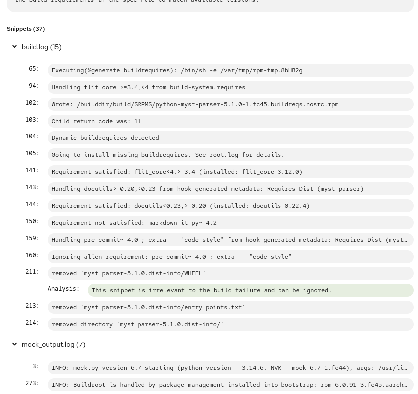

## Weeks 29 and 30 (July 13th – July 27th)

- The ogr library now correctly handles the Forgejo `error` commit flag, resolving an issue
  that previously caused it to fail during internal mapping.
  ([ogr#991](https://github.com/packit/ogr/pull/991))
- Log Detective run overview on the dashboard now, for successful runs, shows also a list
  of snippets, grouped by file, in expandable sections.
  ([dashboard#540](https://github.com/packit/dashboard/pull/540))
  
